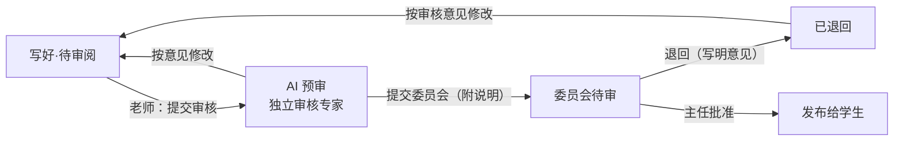

# 问渠 AI 建课：整体流程与数据结构设计

Sep 27, 2026 · @eddie

## 设计原则

老师只负责把资料交进来，整理、分类、组织课程的全部负担都在 AI。资料再杂乱，也是 AI 的活，不是老师的活。

- **不要求老师先整理**：命名混乱、目录随意、版本重复、扫描件和手机照片混杂，都属于正常输入。
- **看内容，不看文件名**：分类和归章依据文件内容，文件名和目录只作为辅助线索。
- **AI 先做决定，老师只做确认**：AI 给出完整的课程结构，只把没把握的地方标出来请老师定夺，而不是让老师逐行核对。
- **不打断老师**：资料在后台慢慢接收、慢慢处理，老师交完就可以离开，完成后再通知。
- **可追溯**：课程里的每一项内容都能追溯到来源文件和页码，老师可以随时查证、推翻 AI 的判断。
- **单个失败不影响整体**：某个文件解析失败，只标记该文件，其他文件照常处理。

## 整体流程

建课分 8 个阶段，老师只在第 1 步和第 6 步出现，其余全部在后台由 AI 完成。

&#91;embedded content: AI 建课流程 · 8 个阶段，老师参与 2 个\]

阶段 2 到 5 是流水线，按文件逐个推进，不等全部上传完。老师以后往资料里加新文件，只对新文件重跑阶段 2 到 5，再增量更新课程结构。

## 资料接收与后台上传

老师选一次文件夹就可以离开，浏览器在后台逐个上传，服务器每收到一个文件就立即入队处理，不等全部传完。

**入口（V1 先做前两种）**

- 选择文件夹：`<input type="file" webkitdirectory>`，保留子目录路径作为分类线索。
- 拖入文件或压缩包：压缩包在服务器端解开，按文件逐个入队。
- 网盘或共享目录（V2）：老师授权后由服务器定时拉取，老师电脑关机也不影响。

**上传策略**

- 全局上传队列，挂在问渠的页面框架上，老师在站内切换页面不会中断。
- 同时只传 1–2 个文件，空闲时再加快，不占满老师的网络。
- 每个文件上传前先计算哈希：服务器已有的文件直接跳过，实现断点续传和去重。
- 页面意外关闭后，下次打开提示"还有 N 个文件未完成"，一键继续。
- 右下角常驻进度条，显示"后台处理中 8/24"；全部完成后站内通知，V2 加微信通知。

**过滤**

自动跳过 Office 临时文件（`~$` 开头）、系统文件（`.DS_Store`、`Thumbs.db`）和空文件。视频和超大文件只登记、不解析，归入课程资源，由老师决定是否使用。

## AI 整理流水线

整理分两层：先对每个文件单独处理（可并行、可重试），再在课程层面汇总。大模型每次只看一个文件或一批摘要，永远不一次吞下全部原文，这样既不超时，也不超出上下文长度。

**文件层（每个文件独立跑一遍）**

| 步骤 | AI 做什么 | 产出 |
| --- | --- | --- |
| 解析 | 按格式抽取文本和结构：Word、PDF、PPT 逐页，Excel 逐表，图片和扫描件做 OCR | 分页文本、标题层级 |
| 摘要 | 生成文件摘要、关键词、涉及的知识点 | 200–400 字摘要 |
| 识别类型 | 依据内容判断：教学大纲、教学日历、教案、讲义、课件、习题、试卷、实验指导、参考资料 | 类型 + 置信度 |
| 指纹 | 计算内容指纹，用于判断重复和版本关系 | 内容哈希、相似度向量 |
| 切分 | 多章节的大文件按知识点切成片段，每段记录来源页码 | 内容片段 |

**课程层（汇总后跑）**

| 步骤 | AI 做什么 | 产出 |
| --- | --- | --- |
| 去重选版 | 内容相似的文件归为一组，按修改时间、完整度、文件名线索（"终稿""v2"）选出主版本 | 版本组 + 主版本 |
| 建骨架 | 以教学大纲和教学日历为骨架，定出章、节、周次；没有大纲时由 AI 从全部摘要归纳出章节 | 课程结构树 |
| 归位 | 把每个片段挂到对应的知识点和周次上 | 片段 → 节点映射 |
| 找缺口 | 对照每个节点应有的资料类型，列出缺失项，例如"第 5 章没有习题" | 缺口清单 |
| 标疑问 | 置信度低的判断标记出来，留给老师确认 | 待确认清单 |

**截图里的"识别出 3 章"问题**：章节应以大纲为准，AI 从大纲里读出章节后，再用其余资料去对齐，而不是由各文件各自投票凑出章节。

## 老师确认环节

确认页展示的是 AI 已经整理好的课程，而不是一张待核对的文件表。老师默认直接通过，只处理 AI 标出的少数疑问。

**页面布局**

- 左侧：课程结构树（章 → 节 → 周次），每个节点显示已挂的资料数量和类型图标。
- 右侧：选中节点的资料清单，每项可点开原文，定位到来源页码。
- 顶部摘要："已整理 24 个文件，合并重复 3 组，建成 12 章 36 节，有 4 处需要您确认，发现 5 处资料缺口"。

**老师可以做的操作**

- 逐条处理疑问项：接受 AI 的判断，或改成别的章节、类型。
- 拖动资料到其他节点，拖动调整章节顺序。
- 对缺口项选择：让 AI 生成草稿、稍后自己补充、忽略。
- 恢复被判为旧版本的文件。

**原则**：老师的每次修改都记录下来，作为这门课和这位老师的偏好；AI 再次整理（例如新增资料后）时不会推翻老师改过的地方。

## 数据结构

共 9 张表，放在 Moodle 插件 `local_wenquest` 下（表名前缀 `local_wq_`）。原始文件存入 Moodle 自带的文件存储（File API），表里只存引用。

| 表 | 存什么 | 关键字段 |
| --- | --- | --- |
| `build_job` | 一次建课任务 | id, courseid, userid, status, total\_files, done\_files, created, updated |
| `source_file` | 老师交来的每个文件 | id, jobid, contenthash, rel\_path, filename, mimetype, size, status, error, doc\_type, type\_confidence, summary, keywords, version\_groupid, is\_primary |
| `file_chunk` | 文件切分后的片段 | id, fileid, seq, page\_from, page\_to, title, text, embedding |
| `version_group` | 同一资料的多个版本 | id, jobid, primary\_fileid, reason |
| `course_node` | 课程结构树：章、节、周次 | id, jobid, parentid, kind(chapter/section/week), title, sortorder, week\_no, source(syllabus/ai/teacher) |
| `node_material` | 片段挂到哪个节点 | id, nodeid, chunkid, role(讲义/课件/习题/实验…), confidence |
| `gap` | 资料缺口 | id, nodeid, missing\_type, resolution(generate/later/ignore), generated\_ref |
| `review_item` | 待老师确认的疑问 | id, jobid, target\_table, target\_id, question, ai\_answer, teacher\_answer, status |
| `teacher_override` | 老师改过的地方 | id, jobid, target\_table, target\_id, field, old\_value, new\_value, created |

**几点说明**

- `contenthash` 同时用于断点续传（已有就跳过）和精确去重；相似但不相同的文件由 `version_group` 处理。
- `embedding` 是片段的向量，用于归位和相似度判断；V1 可以先存在 MySQL 的 BLOB 字段里，量大后再迁到专门的向量库。
- AI 重新整理时，先读 `teacher_override`，老师改过的字段一律保留。

## 后台任务与状态机

所有 AI 处理都走 Moodle 的后台任务（adhoc task），网页请求只负责收文件并立即返回，根治"出错了，请稍后再试"这类超时问题。

&#91;embedded content: 单个文件的状态 · 7 个状态，1 个重试循环\]

重试间隔逐次加长（1 分钟、5 分钟、30 分钟），大模型限流（429）和网络错误都走这条路。

**任务拆分**

- `process_file`：每个文件一个任务，完成文件层的全部步骤。
- `organize_course`：当所有文件都到达"已解析"或"需老师处理"时触发，完成课程层汇总。老师新增文件时再次触发，只做增量更新。
- `generate_content`：老师在确认页选择"让 AI 生成"的缺口，逐个生成草稿。

**建课任务（build\_job）的状态**：接收中 → 整理中 → 待确认 → 生成中 → 已发布。前端每 5 秒轮询一次状态和进度。

## 与 Moodle 的对接

Moodle 只作为幕后引擎：问渠自己的建课页面负责交互，确认后才把结果写成标准的 Moodle 课程，老师和学生看到的都是问渠界面。

| 问渠里的 | 写成 Moodle 的 |
| --- | --- |
| 章 / 周次 | 课程版块（section） |
| 讲义、课件、参考资料 | 文件资源（resource）或页面（page） |
| 习题 | 作业（assign）或测验（quiz）题库 |
| 试卷 | 测验（quiz），题目进题库 |
| 实验指导 | 页面（page）+ 作业提交 |
| 教学大纲、教学日历 | 课程简介和日历事件 |

**用到的 Moodle 机制**

- 插件类型：`local_wenquest`（local 插件），建课页面、上传接口和数据表都在这里。
- 后台任务：`\core\task\adhoc_task`，由 Moodle 的 cron 执行，cron 建议每分钟运行一次。
- 文件：File API 存原始文件，按 `contenthash` 自然去重。
- 写课程：调用 `course_create_section`、`add_moduleinfo` 等核心函数，发布前可先写入一门隐藏的草稿课程，老师预览满意后再切换为可见。

**需要您确认的一个配置**：大模型接口是直接调用 Claude API，还是经过国内的模型网关？这会影响限流策略和数据是否出境的合规安排。

## V1 范围与演示脚本

V1 的目标是一场可信的现场演示：把一位老师真实、杂乱的资料文件夹拖进去，几分钟后得到一门结构清晰、可以直接上课的课程。

**V1 做**

- [ ] 选择文件夹和拖入压缩包两种入口，后台逐个上传，断点续传
- [ ] Word、PDF、PPT、Excel、图片的解析与 OCR
- [ ] 文件层全部步骤：摘要、识别类型、指纹、切分
- [ ] 课程层：去重选版、以大纲建骨架、归位、找缺口、标疑问
- [ ] 确认页：结构树、疑问处理、拖动调整、缺口生成草稿
- [ ] 发布为 Moodle 隐藏草稿课程，预览后上线
- [ ] 替换笼统报错，显示具体原因和处理进度

**V2 再做**

- 网盘和学校 NAS 对接，服务器定时拉取
- 微信通知、微信小程序查看进度
- 本地"问渠同步助手"客户端
- 跨课程复用：同一教研室的资料互相参考

**演示脚本（约 8 分钟）**

1. 打开一个真实的"大学物理（上）课程资料"文件夹，展示它有多乱：重复的终稿、随意的文件名、手机拍的教案。
2. 拖进问渠，老师点完就离开，右下角显示后台进度。
3. 讲解期间文件逐个完成，页面实时出现摘要和类型。
4. 打开确认页："24 个文件，合并 3 组重复，建成 12 章，4 处需确认，5 处缺口"。
5. 处理一条疑问，对一处缺口点"让 AI 生成"，当场生成习题草稿。
6. 发布，切到学生视角，展示完整课程。

**待定问题**

- 大模型走 Claude API 还是国内网关（见上一节）。
- 演示用的真实资料来源：用您手头的物理课资料，还是向合作学校要一门课？

## 教授团队（第 3 轮重建后，2026-09-30）

起因：Eddie 试建机器人课，指定的教材没找到，第一课动画是物理课的。根因是团队把物理样品当模板、兜底动画写死 AGV、老师的话不是命令、没有“这门课自己的设计”、兜底也报“审稿通过”。重建后的规矩：

1. **老师的话就是要求**：描述和对话里的教材、定位、要求进入每个角色的提示（“binding”）。老师点名的教材按书名/作者/文件名匹配，匹配分 ≥0.6 直接定为主教材，否则问老师（候选文件 + “资料里没有这本书”）。扫描版 PDF 用 Tesseract（chi_sim+eng，本地运行，国内可用）识别，缓存在 `{fid}.ocr.json`，带 `[第N页]` 页标。
2. **课程设计书** `proj.design_book`：大纲出来后由课程设计师写（学科与对象、教材、贯穿全课的机器人平台、符号、动画风格、每章动画/实验/机器人问题、不要出现），老师可在“大纲与日历”里改（`PUT /studio/projects/{pid}/design-book`，改过的标 `by: teacher`，以后不再被 AI 覆盖）。主讲、动画师、实验师、审稿人的提示里都带它（`course_brief`）。
3. **范例只教写法**：动画师看 `demo_anim.TECHNIQUE`、实验师看 `labkit/technique_lab.js`，内容全是占位；物理样品 `AGV_2_1`、`demo_lab_2_1.js` 只留给测试和相似度对照。部件库按学科扩充：动画 `wq_anim` 加了 `rot_x/y/z、proj3、frame2/3、planar_fk、planar_arm、mobile_robot、lidar、matrix_tex`；实验 kit 加了 `api.rot2、fk、arm、frame、robot、lidar、plot`。
4. **两道自动把关**：相似度检查（`production/similar.py`，6 词元片段，和任一参照重合 ≥40% 或含占位文字即退回；参照 = 两个范例 + 本课程其他课）；切题检查（审稿人看渲染出的 3 张关键帧 / 实验截图 + 全部字幕文字，不切题退回，连同出错最多 3 次）。
5. **诚实**：做不成就写进 `les.attention`（kind = animation / lab），课时标“需要你处理”，对话不说“审稿通过”；有“重做动画”（`POST .../lessons/{lid}/animation`）和“重做实验”。兜底简版动画只用本课自己的标题、题面、要点和公式，不画任何机器人。
6. **每课审稿清单** `les.checklist`：教材已参照（自动 + AI）、机器人问题是本课的（AI）、动画切题（自动 + AI，附关键帧）、实验切题且能完成（自动 + AI，附截图）、数值单位（AI）、中英一致（AI）。

## 课程负责人（专家版）与课程委员会（第 5、6 轮，2026-09-30）

**课程负责人（专家版）**：直接由 Claude（Opus，`WQ_LEAD_MODEL`，账号上没有时自动退回写课用的模型）担任：深度思考，自己决定查什么——资料清单、教材目录、按页读原文、关键词检索、教材研读笔记（读写）、大纲、设计书、已写的课——想清楚再答，最后给提议卡片。程序只守三条规矩：改动和开工须老师确认；喊停必停；已发布的不动。教材研读笔记（`textbook_notes`，按章）存进项目，写课、设计书、重做大纲都以它为依据；书不在资料里时按模型对这本书的了解写，标“未见原书”。另有“推倒重来”（重读教材 → 笔记 → 设计书和大纲）。按项目打开（`lead_v2`），试点只开“机器人学”。

**课程委员会**：一课从写好到学生看到，要过两道关：

| 数据 | 位置 | 内容 |
| --- | --- | --- |
| 委员会 | `committee.json`（项目目录旁，随 studio 备份） | `members[{id,name,email,key}]`、`chair`、`self_review` |
| 审核流程 | 每课 `review_flow` | `state`（空 / prereviewed / submitted / returned / approved）、`prereview`（结论、六个方面 ✓✗?、问题清单、亮点）、`note`、`history[{ts,who,action,comment}]` |

规则：每一课单独审；主任一人批准即发布（用主任自己的平台账号发布，主任要有这门课的编辑权限）；试点期允许老师本人以主任身份批准自己的课，记录注明“本人审核”（`self_review` 可在管理页关掉）。委员会审核期间这一课锁定，不能重写。
