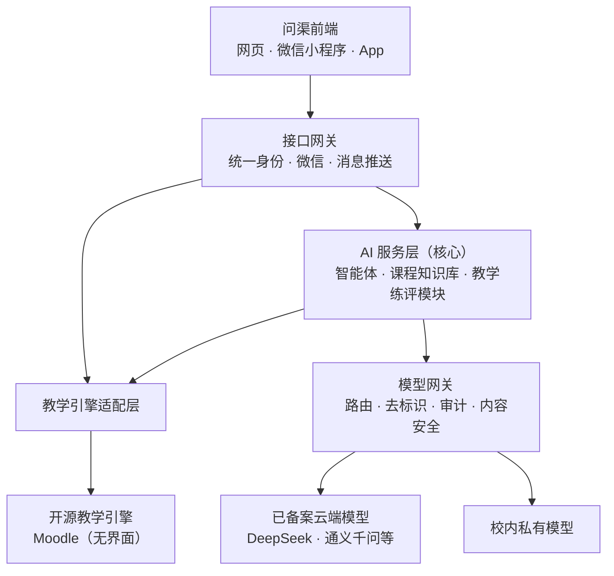
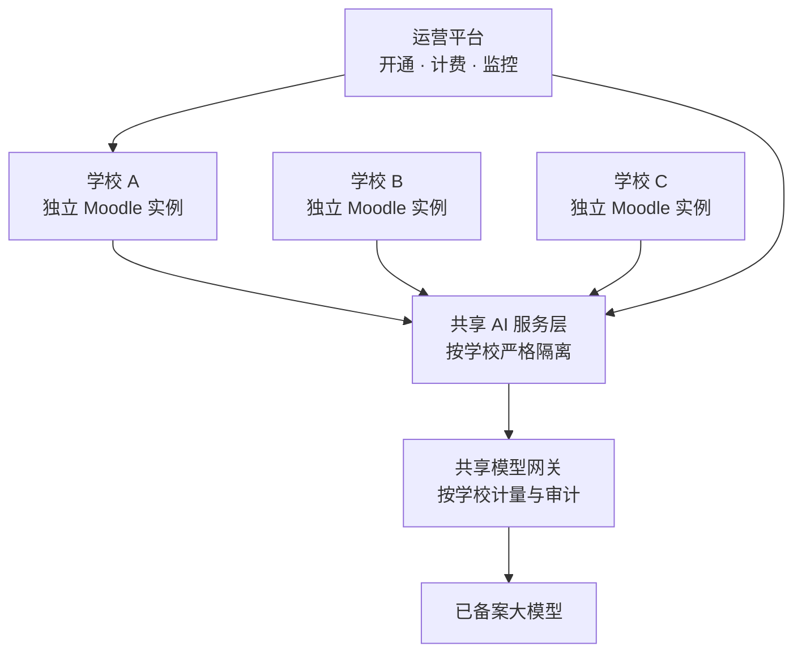

# 问渠 WenQuest 智慧教学平台建设方案

Sep 24, 2026 · @eddie

## 一、项目概述与建设目标

问渠 WenQuest 是一个 AI 原生、适应国内生态的智慧教学平台。师生在网页和微信小程序上使用，AI 贯穿建课、教学、学习、评价全流程；后台采用全球验证过的开源教学引擎 Moodle，数据归学校、模型可更换。平台先在一个学院试点一学期，验证成效后推广到全校，并以云服务形式向其他院校开放。

“问渠”取自朱熹“问渠那得清如许，为有源头活水来”，英文 WenQuest 取“文”与“探求”之意。它代表平台最核心的承诺：AI 的每个回答都依据课程资料，并能追溯到出处（*Every answer has a source.*）。

**核心理念**：AI 做教师的助手，不替代教师；AI 引导学生思考，不代替学生完成学习。

**建设目标**

1. **AI 原生**：建课、备课、出题、答疑、批改、评价都由 AI 承担重复性工作，教师把时间投入教学设计和师生互动。
2. **为学生提供个性化支持**：每门课配备基于本课程资料的 24 小时 AI 助教，并有情景练习和个性化学习路径。
3. **适应国内生态**：微信和企业微信登录与推送、微信小程序、已备案国产模型、教务与统一身份对接、信创环境。
4. **用数据驱动教学管理**：学情分析、学业预警和过程性评价贯通课程、院系、学校三级。
5. **数据主权与安全可控**：教学数据由学校掌控，模型可按需选择已备案的云端模型或本地私有模型。
6. **开放与可推广**：开源引擎加国际开放标准（LTI 1.3、xAPI），形成可复制到其他院校的模式和云服务产品。

## 二、政策背景与现状分析

国家政策已明确要求高校推进智能批改、答疑辅导和学情分析，本方案的功能与之一一对应。

**政策依据**

- 2026 年 4 月，教育部等五部门印发[《“人工智能+教育”行动计划》](http://www.moe.gov.cn/srcsite/A16/s3342/202604/t20260410_1433240.html)（教科信〔2026〕1号）。其中“利用人工智能赋能教师教学”一条，提出支撑教师备课、辅助学情分析、推进智能批改、答疑和辅导。
- 同一计划提出遴选面向不同场景的教育智能体上线国家平台、组织先导应用场景项目、打造标杆应用。这为试点成果申报提供了直接通道。
- 教育部已公布三批共 80 个[“人工智能+高等教育”应用场景典型案例](https://bksy.nxu.edu.cn/info/1009/3910.htm)，高校之间的竞争已经开始。

**国内现状**

- 头部高校已大规模落地。据报道，[清华大学已有 440 门课程由人工智能赋能](https://www.smartcity.team/policies/%E5%A4%A7%E6%A8%A1%E5%9E%8B%E6%94%BF%E7%AD%96%E5%BA%93/%E4%BA%BA%E5%B7%A5%E6%99%BA%E8%83%BD%E6%95%99%E8%82%B2%E8%A1%8C%E5%8A%A8%E8%AE%A1%E5%88%92/)，每门课配有全天在线的 AI 助教；[复旦大学](https://www.fudan.edu.cn/2026/0113/c24a148049/page.htm)建立了 AI 大课体系和配套工具平台。
- 主流商业平台已加装 AI 功能。例如[超星泛雅平台已接入 DeepSeek 等大模型](https://www.jju.edu.cn/info/1044/89850.htm)，提供 AI 助教和知识图谱。

**本方案的差异化定位**

| 维度 | 封闭式商业平台 | 问渠 WenQuest |
| --- | --- | --- |
| AI 的角色 | 在原有功能上加装 AI 按钮 | AI 原生：对话和智能体贯穿建课、教学、学习、评价 |
| AI 可信度 | 通用大模型回答 | 只依据本课程资料，每个回答注明出处 |
| 平台开放性 | 厂商私有系统 | 开源教学引擎 + 开放标准，学校可自主扩展 |
| 数据主权 | 数据存放在厂商平台 | 学校自有，可完全私有部署 |
| 模型选择 | 厂商绑定 | 多模型可切换，支持本地模型 |
| 国际化 | 以国内生态为主 | 国际开源生态与标准，适合国际课程与中外合作办学 |
| 教学理念 | 功能堆叠 | 引导式学习，教师在环 |

## 三、技术路线：AI 原生平台 + 开源教学引擎

问渠的前端和 AI 服务层全部自研，师生看不到底层引擎；开源 Moodle 作为无界面的教学引擎在后台管理课程、题库、成绩和权限。选 Moodle 而不是 Canvas 开源版，是因为它在国内更容易部署、维护和招人：

| 维度 | Moodle | Canvas 开源版 |
| --- | --- | --- |
| 私有部署与运维 | PHP，普通服务器即可，学校信息中心能接手 | Rails 加多个配套服务，资源消耗大，运维门槛高 |
| 信创适配 | 支持多种数据库；在国产操作系统和 ARM 服务器上易运行 | 仅支持 PostgreSQL；Ruby 生态国产化经验少 |
| 国内人才 | PHP 开发者多 | Ruby 开发者少 |
| 题库与测验 | 题型多、题库成熟，有编程自动判题等插件 | 开源版测验较基础，新测验引擎属商业服务 |
| 路线依赖 | 社区驱动，功能在开源版中 | 新功能多进入商业服务 |
| 国产模型 | 5.2 已内置 DeepSeek 接入 | 需自行开发 |
| 开源许可 | GPL v3，以云服务提供无需公开改动 | AGPL v3，修改其代码并提供云服务时须公开改动；只调用接口、不改代码时影响较小 |

平台通过“教学引擎适配层”访问引擎，遇到已使用 Canvas 的学校，增加一个适配器即可接入。

**Moodle AI 子系统**：自 Moodle 4.5 起，Moodle 内置 AI 子系统，由三部分组成（[官方开发文档](https://moodledev.io/docs/5.2/apis/plugintypes/ai)）：

- **提供方（Provider）插件**：负责对接外部 AI 服务。本方案将开发国产大模型的提供方插件。
- **调用位置（Placement）插件**：决定 AI 在界面中出现的位置，如编辑器、课程助手。
- **管理器（Manager）**：位于两者之间，负责请求调度和日志记录。

这套设计意味着我们开发的国产模型插件与 Moodle 核心松耦合，Moodle 升级时维护成本低。

**AI 服务层独立于 Moodle**：助教、批改、学情分析等核心能力在独立的 AI 服务层实现，通过教学引擎适配层访问 Moodle，并可经 LTI 1.3 接入其他平台。好处有三：

1. 核心 AI 能力是自主知识产权，不受底座许可证约束。
2. 同一套 AI 服务可以接入使用 Canvas 或其他符合 LTI 标准平台的学校。
3. AI 服务可以独立迭代和扩容，不影响教学平台的稳定运行。

**适应国内生态**：Moodle 过去在国内推不开，原因主要不在技术，而在没有人把它做成适合中国高校的产品和服务。问渠逐项补齐：

| 痛点 | 问渠的解法 |
| --- | --- |
| 没有本地服务商 | 项目方负责部署、运维、培训和售后 |
| 不适应微信生态 | 微信、企业微信、钉钉登录与推送；微信小程序；国内厂商推送 |
| 界面老、上手难 | 自研前端，以对话为核心入口；AI 一键建课、出题 |
| 不对接国内教务 | 教务同步、统一身份、成绩回传 |
| 访问慢 | 去掉境外依赖，改用国内 CDN 与国内验证码 |
| 视频体验差 | 对接国内云点播：转码、防盗链、倍速、续播 |
| 装好是个空壳 | AI 课件工坊从教师资料生成课程；接入国家智慧教育平台等公开资源 |
| 不贴合国内教学管理 | 按国内口径出报表；AI 起草申报材料与教学总结 |
| 信创要求 | 适配国产操作系统、国产 CPU 服务器和兼容 PostgreSQL 的国产数据库（需实际适配测试） |

## 四、总体架构

平台分为前端、AI 服务、教学引擎和模型四大部分，底部由数据与基础设施支撑。详细设计见《问渠 WenQuest 系统架构设计说明书》。

| 层级 | 主要组成 | 说明 |
| --- | --- | --- |
| 问渠前端 | 网页端、微信小程序、品牌 App（一套跨端代码） | 师生的全部界面，以对话和智能体为核心入口 |
| 接口网关 | 统一身份、微信与企业微信登录、消息推送 | 前端的统一入口 |
| AI 服务层 | 智能体编排、课程知识库、各 AI 业务模块 | 平台核心，自主知识产权 |
| 教学引擎适配层 | 课程、用户、题库、成绩、事件的统一接口 | 引擎可替换 |
| 开源教学引擎 | Moodle 5.2（无界面） | 课程、题库、成绩、权限、学习记录 |
| 模型网关 | 多模型路由、限流计量、去标识、审计、内容安全 | 所有模型调用的唯一出口，合规关键点 |
| 模型层 | 已备案云端大模型；校内私有模型 | 敏感数据走本地模型，通用任务走云端模型 |
| 数据与基础设施 | PostgreSQL、Redis、对象存储、向量检索、Kubernetes | 境内存储，支持容器化部署和弹性扩展 |

**关键设计原则**

- **教师在环**：批改结果和学业预警先由教师审核，再发布给学生。
- **有据可查**：AI 助教的回答基于课程资料，并标注出处，减少“幻觉”。
- **模型可替换**：模型网关屏蔽不同模型的差异，更换或新增模型不影响上层功能。
- **标准化接口**：采用 LTI 1.3 和 xAPI 等国际标准，避免被单一平台锁定。

## 五、AI 核心功能模块

平台按“教、学、练、评”提供十个 AI 功能模块，覆盖课前、课中、课后和教学管理全过程。

| 模块 | 环节 | 主要功能 | 设计要点 |
| --- | --- | --- | --- |
| 智能课件工坊 | 教 | 上传大纲和教材，生成整门课设计、每节课教案（含单次课快速备课）、交互动画和讲解微课 | 只依据教师资料；教师审核后发布 |
| 情景教学 | 教 / 学 | AI 扮演病人、历史人物、面试官等角色，结束后按评分标准复盘 | 教师自定角色、隐藏信息和评分标准 |
| 课程 AI 助教 | 学 | 基于本课程资料的 24 小时问答 | 回答标注出处；对作业题只引导不给答案 |
| 虚拟实验 | 学 | AI 生成网页仿真实验；接入国家虚拟仿真实验平台；AI 实验助手 | 操作记录进入过程性评价 |
| 个性化学习路径 | 学 | 基于课程知识图谱和掌握度，推荐复习内容和练习 | 学生可查看自己的掌握度图谱 |
| 智能出题与组卷 | 练 | 按知识点和难度生成题目入题库；自动组卷 | 标注知识点与难度；考后题目质量分析 |
| 智能批改与反馈 | 评 | 主观题、编程作业、实验报告的评分建议和个性化反馈 | 按评分量规打分；教师审核后发布 |
| 学情分析与预警 | 评 | 识别学习困难学生，给出干预建议 | 预警可解释；由教师决定是否干预 |
| 学生过程性评价 | 评 | 全过程成长档案、能力画像、增值评价、AI 评语草稿 | 评价依据对学生公开 |
| 教学评价 | 评 | 评教分析、课程数据分析、课堂分析，生成教师发展报告 | 报告默认只给教师本人；课堂分析需教师同意 |

### AI 虚拟仿真实验包

面向理工科院系，平台提供一套开箱即用的机器人与控制仿真实验：仿真负责算得对，AI 负责教得好。倒立摆 PID 和二连杆机械臂两个实验已有可运行样品（[AI 机器人虚拟仿真实验室](https://claude.ai/artifact/BAijudM2KQqQjy54GwRaZ5)）。

| 内容 | 说明 |
| --- | --- |
| 首批实验 | 倒立摆 PID、机械臂运动学（已有样品）；巡线小车、路径规划（下一批）；SLAM 导航、抓取放置（ROS 2 进阶） |
| 基础档 | MuJoCo 开源仿真内核在浏览器和小程序里运行，不占服务器，适合大班必修课 |
| 进阶档 | Gazebo + ROS 2 容器，每人一个，面向机器人、自动化专业，按使用时长计费 |
| AI 诊断 | 读取整条实验曲线，指出现象、原因和调整方向，不直接给答案 |
| AI 示范 | 学生自己尝试 3 次后解锁，AI 亲自调用仿真演示有条理的调参方法 |
| 一句话指挥 | 学生用中文指挥机械臂，系统检查可达性后执行，AI 解释背后的知识点 |
| 过程性评价 | 按操作规范、调参策略、现象与原理、结果达成四个维度评分，教师复核后计入成绩 |
| 对外对接 | 成绩回写问渠课程；按“实验空间”国家平台接口规范上报数据，支撑虚拟仿真一流课程申报 |

### 问渠自编教材：《机器人学》

问渠为机器人专业编写一本自己的主教材，再用它带动课程建设：先有好教材，再用 AI 出好课。

| 内容 | 说明 |
| --- | --- |
| 定位 | 手册式教材，内容全面，老师授课时自己取舍；同时是工程师的案头参考书。读者起点为高中数学，学术而不晦涩 |
| 规模 | 61 章、302 节，约 1750 页，分数学基础、运动学、动力学、结构与机电设计、控制、感知与智能等篇；旋量理论为主线；先中文，后出英文版 |
| 每节配套 | 书中计算出的数字都由随书程序算出；示意图；3Blue1Brown 风格动画（配静态图）；浏览器里直接做的虚拟实验（二维、三维机器人、电路仿真），每个实验有指导书和报告模板 |
| 质量 | 每次构建自动检查（程序能运行、数字来自程序、公式、编号、引用、术语、实验自动试做），不通过不上线；每章经独立 AI 审稿，再由主编审定 |
| 使用 | 平台“教材”栏目按篇章节阅读，网页和小程序都可读，动画就地播放、实验一键打开；网页版对注册用户开放，PDF 只供老师下载 |
| 与建课的关系 | 教材成形后作为 AI 建课中机器人学课程的主教材，课程直接引用书中的章节、算例、动画和实验 |
| 进度 | 2026-10-01 完成三章样章并上线：第 4 章“刚体的转动”、第 12 章“正运动学：指数积公式”、第 39 章“信号调理与自动检测”，共 17 个虚拟实验、14 个动画。全书进度估算见第 7 轮实施细则 |

### 问渠自编教材：《大学物理》（第 9 轮，2026-10-02 起）

面向理工科（科学家与工程师）的大学物理教材，篇幅与 Serway《Physics for Scientists and Engineers》和 OpenStax《University Physics》三卷相当，做法与《机器人学》相同。

| 内容 | 说明 |
| --- | --- |
| 规模 | 49 章、306 节，约 1900 页：导论，力学、振动与波、热学、电磁学、光学、近代物理六篇；比参考书多出“物理学中的微积分”“用计算机解运动方程”“拉格朗日力学初步”三章 |
| 特色 | 实际问题以机器人为主（与《机器人学》共用零件库模型和数字工厂场景）；每章至少一个测量型虚拟实验；物理常数取 CODATA 2022，符号按国标；两书术语自动核对一致 |
| 阅读 | 与《机器人学》同在“教材”书架；阅读页新增“本章互动资源”“全书互动资源”和“在本页运行”实验（吸收《缝纫机设计与制造》的做法） |
| 进度 | 2026-10-02 样章第 6 章“牛顿运动定律”完成（7 节，4 个动画，4 个虚拟实验，PDF 约 37 页），随后做第 34、44 章样章，再从第 1 章顺序写。见第 9 轮实施细则 |

### 问渠自编教材：《线性代数》（第 10 轮，2026-10-02 起）

高水平、全面的线性代数教材，为机器人服务但不限于机器人。Eddie 未提供参考资料，参照书由 AI 选定（Strang、Lay、Axler、Meyer、Trefethen–Bau、Golub–Van Loan 及同济、北大教材等），只参照选材与深度。按 Eddie 要求自成体系，不考虑与其他教材的分工，由使用教材的教授取舍。

| 内容 | 说明 |
| --- | --- |
| 规模 | 42 章、257 节，约 1250 页：导论，向量与线性方程组、向量空间与线性映射、正交性、特征值、奇异值分解与矩阵分析、数值线性代数、推广与抽象、应用八篇；附七种开课方式的章节表（工科线代、加强版、高等代数、矩阵分析、数值线代、机器人方向、数据与 AI 方向） |
| 特色 | 几何—代数—计算三种语言并行；核心定理给出完整证明；数值意识贯穿全书；应用涵盖机器人、视觉、控制、信号、数据与机器学习、有限元、量子计算；与另两本书共用零件库模型和数字工厂数据、有限元服务 |
| 实验 | 新增“线性变换演示台”和矩阵与数据可视化（热图、图像、奇异值柱状图），作为实验工具包的通用部件 |
| 进度 | 2026-10-02 样章第 18 章“奇异值分解”完成（7 节，5 个动画，4 个虚拟实验，经独立 AI 审稿），等 Eddie 初审，确认文风后从第 1 章顺序写。见第 10 轮实施细则 |

### 问渠自编教材：《微积分》（第 12 轮，2026-10-02 起）

高水平、全面的微积分教材，为机器人服务但不限于机器人。Eddie 提供 Stewart、Anton、Strang 三本作参考；参照书以国外高水平教材为主（约 110 种，逐章列出，见 `docs/教材/微积分/01_参考资料.md`），国内教材只核对覆盖面。

| 内容 | 说明 |
| --- | --- |
| 规模 | 49 章、297 节，约 1450 页：导论，函数极限与连续、一元微分、一元积分、常微分方程、无穷级数、向量与曲线、多元微分、多元积分与向量分析、拓展与应用九篇；附七种开课方式的章节表（工科高等数学、经管微积分、美国式 Calculus I–III、数学分析、机器人方向、AI 方向、研究生先修） |
| 特色 | 图像、数值、符号、语言四种语言并行；直观先行、严格随后，另设实数完备性、黎曼积分理论、一致收敛、多元微分学理论、微分形式等【进阶】章；每个极限过程配一个数值算法并讲清误差；运动是主线（AGV、UR5e 关节） |
| 实验 | 实验工具包新增 `api.graph`（世界坐标绘图：坐标轴、函数曲线、切线、割线、黎曼和）与 `api.calc`（差商、对偶数自动微分、辛普森与黎曼和、二分法、牛顿法、可复现的随机数），即“一元微积分演示台” |
| 进度 | 2026-10-02 样章第 7 章“导数”完成（9 节，5 个动画，4 个虚拟实验，经独立 AI 审稿），等 Eddie 初审，确认文风后从第 1 章顺序写。见第 12 轮实施细则 |

### 问渠自编教材：《机械制造技术》（第 13 轮，2026-10-02 起）

高水平、全面的机械制造教材，为机器人服务但不限于机器人。参照书以国外高水平教材为主（Kalpakjian、Groover、DeGarmo、Klocke、Altintas、Campbell、Altan、Kou、Osswald 等约 180 种，逐章列出），国内教材只核对覆盖面。

| 内容 | 说明 |
| --- | --- |
| 规模 | 77 章、607 节，约 2200 页：制造基础、铸造、塑性成形、焊接、聚合物与复合材料、粉末冶金与增材、切削与刀具、加工方法与机床、数控与 CAM、机械加工工艺、典型零件的加工工艺（项目篇）、装配工艺、计量与质量、制造系统与智能制造、综合项目十五篇；附十二种开课方式的章节表 |
| 特色 | 每次课都像工艺工程师一样工作：每章一张工程任务单，在数字工厂里编工艺、经 AI 工艺评审员预审和老师批准后写进 ERPNext、派到仿真车间加工、三坐标检验；书中算例就是数字工厂的真实数据（SH-301 的工艺规程与工厂用的是同一份） |
| 新能力 | 数字化工艺数据表（逐行出处）；工艺计算书（与《机械设计》共用）；工程任务单（各书共用）；数字工厂的工艺规程与 AI 工艺评审员、工艺生效写 ERPNext 与 MES 派工；质量统计（控制图、过程能力、测量系统分析）。热与非线性有限元、充型流动、虚拟数控机床、增材切片排在用到它们的章节之前 |
| 进度 | 2026-10-02 样章第 50 章完成后，Eddie 初审认为太简单：工艺必须讲透尺寸链、定位与夹具、加工原理与加工误差，会解决现场问题，典型零件都要有，必须有工艺卡和检验卡，必须项目导向。提纲改为 v0.2：机械加工工艺 9 章（先工艺文件，再定位、夹具、尺寸链、精度、表面质量，然后工艺规程上下两章，最后现场问题）+ 典型零件 9 章（每章一个完整项目，给全套工艺文件）+ 装配 2 章，全书 77 章、约 2200 页；每篇设篇首项目。先做工艺文件生成器、尺寸链与定位误差计算、数字工厂问题情景，再按顺序写第 50–69 章。见第 13 轮实施细则第七节 |

**学校管理驾驶舱**：在以上模块基础上，为院系和学校提供课程运行、AI 使用、学业预警的汇总视图，支撑教学质量监测和循证教研。

**学术诚信**：平台支持教师为每项作业设定 AI 使用规则（禁止、允许辅助、要求声明），学生提交时按规则声明 AI 使用情况。

## 六、部署模式：私有部署、云服务版本与混合部署

同一套软件支持三种部署模式，学校按数据要求和运维能力选择；试点阶段建议采用云服务版本，上线最快。

| 模式 | 部署位置 | 适合对象 | 优点 | 代价 |
| --- | --- | --- | --- | --- |
| 校内私有部署 | 学校数据中心或校内私有云 | 数据要求最严、有运维团队的学校 | 数据完全在校内；可部署本地模型 | 需采购服务器和 GPU，需要运维人员 |
| 云服务版本（SaaS） | 国内公有云，由我方运营 | 希望快速上线、运维力量有限的学校 | 开通即用，按需付费，持续升级 | 数据存放在境内云平台，受合同约束 |
| 混合部署 | Moodle 在校内，AI 服务在云端 | 已有 Moodle 或希望平台在校内的学校 | 教学数据留在校内，AI 能力按需使用 | 需配置校内外安全通道 |

### 云服务版本架构

云服务版本部署在国内公有云（如阿里云、华为云、腾讯云），面向多所院校提供服务。

- **每校独立的 Moodle 实例**：每所学校的 Moodle 和数据库运行在独立的 Kubernetes 命名空间中，数据物理隔离，可以按学校定制主题、插件和域名。
- **共享的 AI 服务层**：多校共用一套 AI 服务以降低成本；每校的课程知识库、向量数据和日志按学校编号严格隔离，互不可见。
- **共享的模型网关**：按学校统计调用量和费用，执行各校的内容安全策略和额度限制。
- **运营平台**：负责新学校开通、版本升级、计费、监控告警和数据备份。

### 云服务版本的产品分级

| 版本 | 面向对象 | 包含内容 |
| --- | --- | --- |
| 标准版 | 单个学院或小型院校 | 问渠平台、课程 AI 助教、智能出题 |
| 专业版 | 全校部署 | 标准版全部功能，加智能批改、学情预警、统一身份认证对接 |
| 旗舰版 | 大型高校或需定制的学校 | 专业版全部功能，加管理驾驶舱、专属模型实例、定制开发 |

收费建议采用“按学生人数的年费 + AI 调用用量包”的方式，具体价格在试点后根据实际模型调用成本测算确定。

## 七、安全与合规

平台只调用已备案的大模型，数据全部境内存储，所有模型调用经模型网关审计，从设计上满足国内监管要求。

| 要求 | 依据 | 本方案的措施 |
| --- | --- | --- |
| 生成式 AI 服务登记 | 《生成式人工智能服务管理暂行办法》；[国家网信办公告](https://www.cac.gov.cn/2026-05/13/c_1780413225190669.htm) | 通过 API 调用已备案模型的应用，向属地网信办办理登记；在页面显著位置公示所用模型名称和备案号 |
| AI 生成内容标识 | 《人工智能生成合成内容标识办法》 | AI 生成的回答、反馈和题目在界面上明确标识 |
| 网络安全等级保护 | 《网络安全法》及等级保护制度 | 云服务版本按等保三级建设和测评；私有部署版本配合学校现有等保体系 |
| 个人信息保护 | 《个人信息保护法》 | 学生数据最小化采集；向模型发送前对姓名、学号等身份信息去标识化 |
| 数据境内存储 | 《数据安全法》 | 全部数据和模型调用在境内完成，不使用境外模型服务 |
| 网站与应用备案 | ICP 备案；教育移动应用备案 | 云服务版本完成 ICP 备案；移动端按教育移动应用要求备案 |

**内容安全**：模型网关对输入和输出进行内容安全过滤，拦截违规内容，并保留审计日志以备核查。

**待确认事项**：校内私有部署、仅限本校师生使用的情形，登记与备案的具体要求需与学校所在地网信部门确认。

## 八、实施路线图与评价指标

项目分四个阶段推进，约两年完成从单个学院试点到全校应用和对外服务。

| 阶段 | 时长 | 范围 | 主要工作 | 阶段成果 |
| --- | --- | --- | --- | --- |
| 0. 共建准备 | 约 1 个月 | 学校与项目组 | 需求调研；选定试点学院和 3–5 门课程；签订合作与数据协议 | 试点方案与合作协议 |
| 1. 课程试点 | 1 个学期 | 1 个学院、3–5 门课程 | 上线云服务版本；导入课程资料；启用 AI 助教、智能出题和批改；教师培训 | 试点评估报告 |
| 2. 学院推广 | 1 个学期 | 2–3 个学院 | 对接统一身份认证和教务系统；启用学情预警；按需迁移为私有或混合部署 | 可复制的应用模式 |
| 3. 全校应用与对外服务 | 1 学年 | 全校；其他院校 | 全校推广；上线管理驾驶舱；云服务版本向其他院校开放 | 标杆案例与对外产品 |

**试点评价指标**（试点开始前测基线，试点结束后对比）

| 指标 | 测量方法 |
| --- | --- |
| 教师备课与批改时间 | 教师工作量问卷，对比试点前后 |
| 学生问题的响应时间 | 平台日志中提问到获得回答的时长 |
| AI 回答的准确率 | 教师对抽样回答进行评分 |
| 学生满意度与使用率 | 学期末问卷；平台活跃数据 |
| 学业表现 | 试点课程与往届同课程的成绩和不及格率对比 |
| 预警的有效性 | 被预警学生经干预后的成绩改善情况 |

## 九、合作模式与预期成果

建议采用校企共建模式：学校提供教学场景和试点课程，项目方提供平台、技术和运营，成果双方共享。

**分工**

| 事项 | 学校 | 项目方 |
| --- | --- | --- |
| 试点课程与教师 | 选定课程，组织教师参与 | 提供培训和一对一支持 |
| 平台与技术 | 提供身份认证、教务系统等接口 | 平台部署、AI 服务开发、运维 |
| 数据 | 拥有全部教学数据的所有权 | 仅在协议范围内处理数据，不用于其他用途 |
| 教学研究 | 组织教研，评估教学效果 | 提供数据分析支持 |
| 成果 | 以学校名义申报案例与项目 | 以产品形式推广至其他院校 |

**预期成果**

1. 一个在试点学院实际运行的 AI 智慧教学平台，以及可复制推广的应用模式。
2. 申报教育部“人工智能+高等教育”应用场景典型案例，以及“人工智能+教育”行动计划中的教育智能体遴选和先导应用场景项目。
3. 依托 AI 虚拟仿真实验包，与学校共同建设并申报省级或国家级虚拟仿真实验教学一流课程。
4. 联合发表教学研究论文，共同申报省级以上教改项目。
5. 学校成为该平台的示范基地和共建单位，在后续对外推广中享有优先权益。

## 十、风险与应对

主要风险集中在 AI 准确性、教师接受度和与现有系统的并存，均有对应措施。

| 风险 | 应对措施 |
| --- | --- |
| AI 回答出错（“幻觉”） | 回答限定在课程资料范围内并标注出处；批改结果须教师审核；建立错误反馈机制 |
| 教师接受度不高 | 从有意愿的教师开始试点；先上线减负效果最明显的功能；提供培训和一对一支持 |
| 与现有教学平台并存 | 试点课程在新平台运行，其他课程不受影响；逐步对接教务系统，避免重复录入 |
| 学生过度依赖 AI | 助教对作业题采用引导式提问；教师可为每项作业设定 AI 使用规则 |
| 数据安全事件 | 等保建设；身份信息去标识化；最小权限访问；定期安全审计和渗透测试 |
| 模型服务变化 | 模型网关支持多模型切换，不依赖单一模型厂商 |
| 模型调用成本超出预期 | 按任务选用不同规模的模型；缓存常见问题的回答；设定各校调用额度 |

## 参考来源

- [教育部等五部门关于印发《“人工智能+教育”行动计划》的通知](http://www.moe.gov.cn/srcsite/A16/s3342/202604/t20260410_1433240.html)
- [国家网信办：生成式人工智能服务已备案信息公告（2026 年 3–4 月）](https://www.cac.gov.cn/2026-05/13/c_1780413225190669.htm)
- [Moodle 开发者文档：AI 插件（5.2 版）](https://moodledev.io/docs/5.2/apis/plugintypes/ai)
- [复旦大学发布人工智能共创平台及应用指引](https://www.fudan.edu.cn/2026/0113/c24a148049/page.htm)
- [九江学院：关于超星集团开通“AI 助教、知识图谱”等功能的通知](https://www.jju.edu.cn/info/1044/89850.htm)
