# 问渠 WenQuest 系统架构设计说明书

Sep 24, 2026 · @eddie

本文说明问渠 WenQuest 智慧教学平台的总体架构和各模块设计，供校方信息中心、技术团队和开发人员评审与实施使用。文中标注“已实现”的部分对应 v0.1 部署包，其余为设计方案。

## 一、概述与设计原则

问渠 WenQuest 是一个 AI 原生、适应国内生态的智慧教学平台。师生看到的是自研的网页端和微信小程序；AI 服务层是核心；开源 Moodle 作为无界面的教学引擎在后台管理课程、题库、成绩和权限。所有模型调用都经过统一的模型网关。

品牌口号“问渠那得清如许，为有源头活水来”（*Every answer has a source.*）也是系统的第一设计原则：AI 的每个回答都依据课程资料，并能追溯到出处。

**系统边界**

- **系统之内**：问渠前端、接口网关、AI 服务层、教学引擎适配层、Moodle 及自研插件、模型网关、数据存储、运维平台。
- **外部依赖**：学校统一身份认证、教务系统、大模型服务（国内为 DeepSeek、通义千问等已备案模型或校内私有模型；Claude 仅用于海外演示）、短信与邮件通知服务。

**设计原则**

| 原则 | 含义 | 在架构中的体现 |
| --- | --- | --- |
| AI 原生 | AI 贯穿建课、教学、学习、评价全流程，而不是加装一个按钮 | 前端以对话和智能体为核心入口；AI 服务层是系统中心 |
| 有据可查 | AI 回答基于课程资料并注明出处 | 助教统一走课程知识库检索，回答附来源链接 |
| 教师在环 | AI 只给建议，关键结果由教师确认 | 批改、预警、课件有“待审核”状态，审核后才对学生可见 |
| 适应国内生态 | 长在师生已有的工具和制度里 | 微信、企业微信、钉钉；已备案模型；教务与统一身份；信创环境 |
| 模型可替换 | 不绑定单一模型厂商 | 所有模型调用只经过模型网关，按配置路由 |
| 引擎可替换 | 不被单一教学平台锁定 | 前端与 AI 服务只通过“教学引擎适配层”访问 Moodle，以后可接入 Canvas 等 |
| 数据归学校 | 教学数据由学校掌控 | 数据境内存储；发往模型前去除身份信息；支持完全私有部署 |
| 少改核心 | 便于跟随引擎升级 | 不修改 Moodle 核心代码，扩展全部以插件和独立服务实现 |

## 二、总体架构

系统分为七层：多端前端、接口网关、AI 服务层、教学引擎适配层、教学引擎（Moodle，无界面）、模型网关和模型层，底部由数据与基础设施支撑。

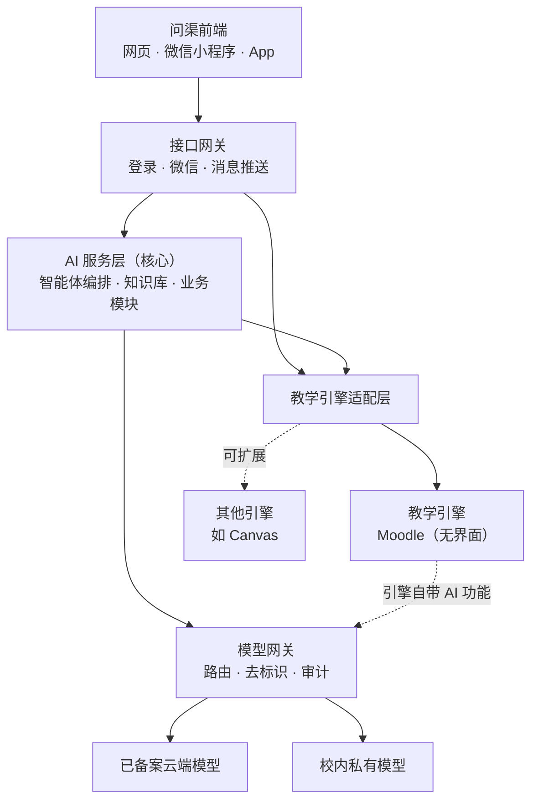

师生只与问渠前端打交道，看不到 Moodle 界面。前端和 AI 服务层不直接调用 Moodle，而是经过教学引擎适配层，引擎因此可以替换。虚线表示 Moodle 自带的 AI 功能也经模型网关调用，所有模型调用都有统一的审计和计量。

### 各层职责

| 层级 | 主要组件 | 职责 | 详见 |
| --- | --- | --- | --- |
| 问渠前端 | 网页端、微信小程序、品牌 App（一套跨端代码） | 师生的全部界面；以对话和智能体为核心入口 | 第三、四节 |
| 接口网关 | 认证、微信与企业微信对接、消息推送、限流 | 前端的统一入口 | 第三节 |
| AI 服务层 | 智能体编排、课程知识库、各业务模块 | 所有 AI 业务逻辑，系统核心 | 第六至十六节 |
| 教学引擎适配层 | 课程、用户、题库、成绩、事件的统一接口 | 屏蔽引擎差异，引擎可替换 | 第四节 |
| 教学引擎 | Moodle 5.2（无界面）及其数据与接口插件 | 课程、题库、成绩、权限、学习记录 | 第四、五节 |
| 模型网关 | 路由、限流、去标识、内容安全、审计、计量 | 所有模型调用的唯一出口 | 第十七节 |
| 模型层 | DeepSeek、通义千问等已备案模型；校内开源模型；海外演示用 Claude | 文本生成、向量化 | 第十七节 |
| 数据与基础设施 | PostgreSQL 16 + pgvector、Redis、对象存储、Kubernetes 或 Docker | 存储、缓存、队列、容器运行 | 第十八、二十节 |

### 技术选型

| 部分 | 选型 | 理由 |
| --- | --- | --- |
| 前端 | Vue 3 技术栈的跨端框架（如 uni-app） | 一套代码输出网页、微信小程序和 App；国内开发者熟悉 |
| 教学引擎 | Moodle 5.2（PHP 8.3），无界面使用 | 题库与成绩成熟、运维简单、易适配信创；详见下文“教学引擎选型” |
| AI 服务层与接口网关 | Python 3.12 + FastAPI | AI 与数据处理生态最完整，异步性能好 |
| 异步任务 | Celery + Redis | 批量批改、资料入库、微课渲染、学情计算 |
| 向量检索 | PostgreSQL pgvector | 与业务库同一套数据库，减少运维组件 |
| 向量与重排模型 | bge-m3、bge-reranker（开源，本地部署） | 中文效果好，资料不出校 |
| 容器与编排 | Docker（单机）、Kubernetes（集群 / 多租户） | 同一套镜像适配私有部署和云服务 |
| 监控 | Prometheus + Grafana、Loki | 指标、日志、告警 |

### AI 原生设计

| 环节 | 加装 AI（常见做法） | 问渠的 AI 原生做法 |
| --- | --- | --- |
| 入口 | 菜单里多一个“AI 助手”按钮 | 主要操作都可一句话完成：“把这章做成 3 次课的教案和随堂测”；智能体调用平台功能完成任务，教师确认 |
| 建课 | 手工建章节、传文件、出题 | 上传资料，AI 生成整门课的结构、课件、题库 |
| 学习 | 看视频、做题 | AI 助教、情景练习、个性化学习路径 |
| 评价 | 期末一张试卷 | AI 预批改 + 全过程评价，教师把关 |
| 数据 | 事后导出报表 | AI 主动提醒：“这周有 5 个学生需要关注” |

智能体通过教学引擎适配层调用平台功能（建章节、入题库、建测验、查成绩），有写操作的任务先生成预览，教师确认后才执行。

### 教学引擎选型：为何是 Moodle，而不是 Canvas

无界面架构下，Canvas 的界面优势不再重要，只通过接口调用且不修改其代码时 AGPL 的影响也较小；Canvas 的 REST API 设计也更规整。权衡后仍选 Moodle：

| 维度 | Moodle | Canvas 开源版 |
| --- | --- | --- |
| 私有部署与运维 | PHP，普通服务器即可，学校信息中心能接手 | Rails 加多个配套服务，资源消耗大 |
| 信创适配 | 支持多种数据库；PHP 在国产操作系统和 ARM 服务器上易运行 | 仅支持 PostgreSQL；Ruby 生态国产化经验少 |
| 国内人才 | PHP 开发者多 | Ruby 开发者少 |
| 题库与测验 | 题型多、题库成熟，有编程自动判题等插件 | 开源版测验较基础，新测验引擎属商业服务 |
| 路线依赖 | 社区驱动，功能在开源版中 | 新功能多进入商业服务 |
| 国产模型 | 5.2 已内置 DeepSeek 接入 | 需自行开发 |
| 开源许可 | GPL v3，以云服务提供无需公开改动 | AGPL v3，修改其代码并提供云服务时须公开改动；只调用接口、不改代码时影响较小 |

教学引擎适配层保证这个选择可以改变：遇到已使用 Canvas 的学校（如中外合作办学），增加一个 Canvas 适配器即可接入。

## 三、用户接入、移动端与微信

师生用学校已有账号单点登录，平台不另建密码体系。登录由接口网关完成，网关再经教学引擎适配层以该用户身份换取引擎令牌，师生始终看不到 Moodle 登录页；账号、课程和选课关系从教务系统自动同步。

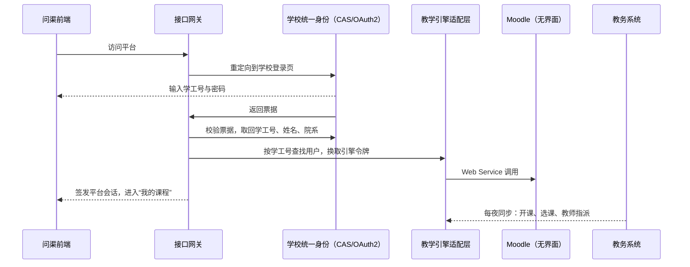

| 功能 | 实现方式 | 说明 |
| --- | --- | --- |
| 单点登录 | 接口网关的 CAS、OAuth2 或 LDAP 认证模块 | 按学校现有统一身份协议选用；校验通过后由网关签发平台会话 |
| 引擎令牌 | 适配层按用户换取 Moodle Web Service 令牌 | 令牌短期有效，只保存在服务端，不下发到前端 |
| 账号与选课同步 | 自研同步插件 `local_sisync`（定时任务） | 从教务接口或数据库视图读取课程、教师、选课，增量更新 |
| 角色映射 | 问渠角色对应 Moodle 角色体系 | 学生、教师、助教、辅导员、院系管理员、校级管理员；辅导员只看所带班级的预警 |
| 多终端 | 问渠前端：网页、微信小程序、品牌 App（一套代码） | 详见 3.1；通知可推送到微信、企业微信或邮件 |
| AI 使用告知 | 问渠前端首次使用 AI 前展示告知 | 记录同意时间，并同步到 Moodle 的 AI 政策确认记录 |

### 3.0 学院自有账号：注册、审核与统一登录（第 3 轮 C 步）

问渠机器人学院面向社会招生，除了上面的学校单点登录，还提供自有账号：

- **注册**：邮箱验证码（6 位、10 分钟有效，按邮箱和 IP 限频）。学生验证后立即开通；教师用学校邮箱（.edu、.edu.cn、.ac.cn 等）自动开通，其他邮箱先按学生开通，同时生成“教师申请”。
- **AI 管审核，管理员一键批准**：AI 预审教师申请（单位、邮箱域名、证明材料），证据不足时 AI 自动发邮件请申请人补材料；管理员在“管理 → 教师审核”里看 AI 建议，点批准或拒绝，结果邮件自动发出；新申请每小时最多汇总一封邮件给管理员。
- **统一登录**：网关登录后另发 `wq_sso` Cookie（HttpOnly，对整个主域名有效）；官网、学习平台、虚拟实验室都认它。
- **课程目录与收费结构**：教师把课程设为“不公开 / 公开·免费 / 公开·收费”；免费课一键加入，收费课先报名、管理员一键开通（在线支付以后接入）。
- **实现**：账号仍在 Moodle；插件 `local_wenquest` 的 `local_wenquest_account_*` 接口放在独立服务 `local_wenquest_accounts` 里，只有网关的服务账号 `wqservice` 能调用（令牌由 `WQ_SECRET_KEY` 推导）。验证码、申请、AI 意见、目录设置存在网关数据卷的 `accounts.db`，随每日备份。发信走 SMTP（Brevo 2525 端口）。

### 3.1 多端架构

网页、微信内网页、小程序和 App 都是问渠前端的不同形态，共用一套跨端代码和同一个接口网关。网关负责统一身份与微信登录、消息推送和接口适配，业务逻辑不重写；任何终端都不直接访问 Moodle。

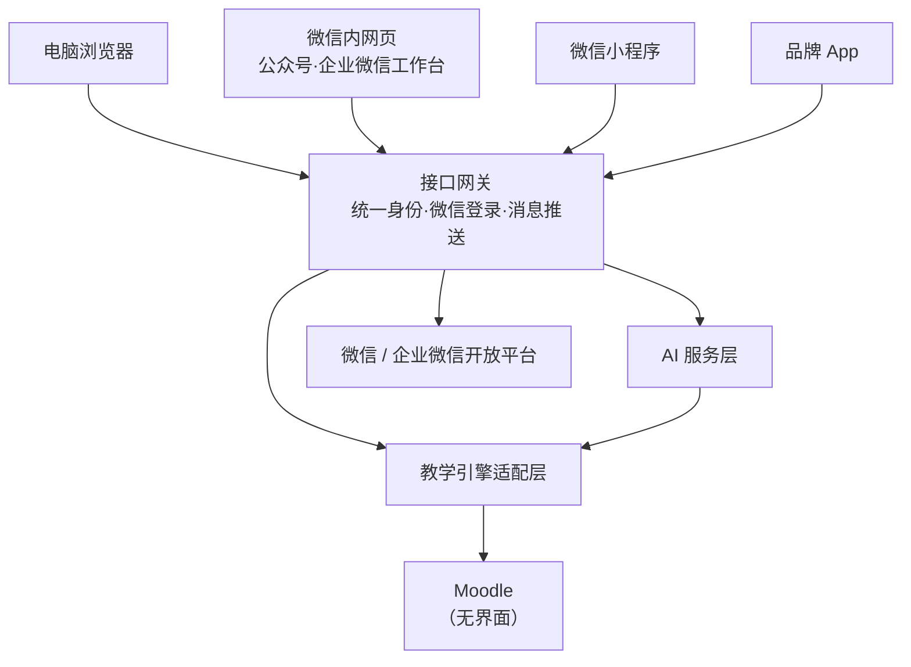

| 入口 | 做法 | 适合 | 阶段 |
| --- | --- | --- | --- |
| 微信内网页（H5） | 问渠前端的 H5 版本，挂在学校公众号菜单或企业微信工作台 | 最快上线，不需审核上架 | 试点期 |
| 微信小程序 | 同一套代码编译为小程序，调用接口网关 | 学生高频使用：AI 助教、随堂测、消息、情景练习 | 学院推广期 |
| 品牌 App | 同一套代码打包为 App | 离线下载课件与视频、系统推送 | 全校推广后按需 |

### 3.2 微信与企业微信接入

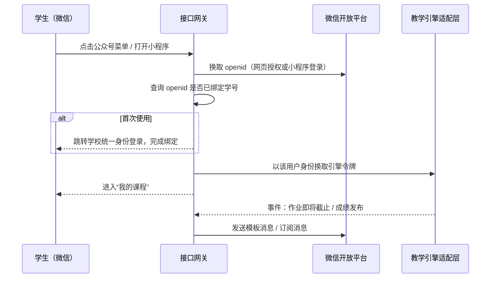

| 功能 | 微信公众号 / 小程序 | 企业微信 |
| --- | --- | --- |
| 登录 | 首次用学校统一身份绑定 openid，之后免密登录 | 企业微信身份直接对应工号或学号，无需绑定 |
| 组织架构 | 不提供 | 可同步院系、班级和教师名单 |
| 消息推送 | 公众号模板消息；小程序订阅消息（需用户授权订阅） | 应用消息，适合教师和辅导员 |
| 典型消息 | 作业截止提醒、成绩发布、老师回复 | 待审核批改、学业预警、课程周报 |

消息统一由平台的通知中心分发，用户可自选收取渠道（微信、企业微信、邮件、站内），防止重复打扰。

### 3.3 微信小程序

| 页面 | 功能 |
| --- | --- |
| 首页 | 今日课程、待办（作业、测验）、最新消息 |
| 课程 | 章节、课件、微课视频、交互动画 |
| AI 助教 | 按课程提问，回答注明出处，标识 AI 生成 |
| 随堂测与签到 | 扫码进入，实时回传成绩 |
| 情景练习 | 角色对话与复盘；外语情景支持语音 |
| 我的 | 成绩、掌握度图谱、成长档案、消息设置 |

技术选型：与网页端、App 共用一套 uni-app 代码（见第二节），编译为微信小程序。AI 助教回答采用流式返回，逐字显示。

### 3.4 品牌 App

- 品牌 App 与网页、小程序同为问渠前端，由同一套 uni-app 代码打包，改为学校品牌（名称、图标、配色），支持离线下载课件与视频。
- 推送改接手机厂商推送（华为、小米、OPPO、vivo、荣耀）或第三方推送服务，由接口网关的通知中心统一发送。
- 学校如希望保留 Moodle 原生界面，也可改用 Moodle 官方开源 App 定制品牌；它依赖谷歌推送，同样需改接国内推送。

### 3.5 备案、上架与审核

| 事项 | 要求 |
| --- | --- |
| 注册主体 | 小程序、公众号和 App 以学校或合作公司名义注册，选择教育类目并提交相应资质 |
| 备案 | 小程序备案、App 备案；上架安卓应用商店通常还需软件著作权证书 |
| AI 功能 | 生成式 AI 功能需提供所用大模型的备案信息及平台要求的相关证明；界面标识 AI 生成内容 |
| 个人信息 | 隐私政策、首次启动告知同意、按需申请权限，满足应用商店和监管检测 |
| 上架渠道 | 微信小程序平台；苹果 App Store（中国区需 App 备案号）；华为、小米、OPPO、vivo、应用宝等安卓商店 |

这些手续耗时较长，建议在试点期就启动主体注册与备案，与小程序开发并行。

## 四、教学引擎层与引擎适配层

Moodle 作为无界面的教学引擎，负责课程、题库、成绩、权限和学习记录这些教学数据；师生看不到它的界面。前端和 AI 服务层通过教学引擎适配层访问它，适配层对外提供统一的课程、用户、题库、成绩和事件接口。Moodle 管理后台只供运维人员使用。

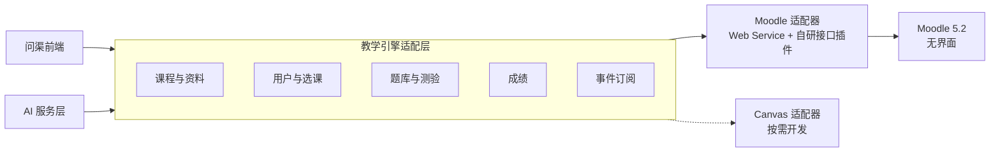

**Moodle 核心承担的功能**

- 课程结构、活动与资源（页面、文件、讨论区、作业、测验）。
- 题库、评分量规（Rubric）、成绩册。
- 角色与权限（capability）体系。
- 事件日志：登录、浏览、提交、评分等行为数据，是学情分析的数据来源。
- AI 子系统：课程助手（总结、解释）和编辑器 AI（生成文字），由 AI 提供方插件对接模型。

**自研插件**

| 插件 | 类型 | 功能 | 阶段 |
| --- | --- | --- | --- |
| `aiprovider_claude` | AI 提供方 | 把 Claude 接入 Moodle AI 子系统（海外演示用，国内部署包不安装） | 已实现（v0.1） |
| `aiprovider_ailms` | AI 提供方 | 把 Moodle 原生 AI 功能改为经自建模型网关调用 | 试点前 |
| `local_aiservice` | 本地插件 | 与 AI 服务层通信：签名调用、事件推送、资料同步 | 试点前 |
| `block_aitutor` | 区块 | 课程页上的 AI 助教对话框 | 试点前 |
| `mod_aiscenario` | 活动 | 情景教学：角色对话与复盘 | 试点前 |
| `local_aigrading` | 本地插件 | 在作业评分页显示 AI 建议分、依据和反馈草稿 | 试点期 |
| `qbank_aigen` | 题库插件 | 按知识点和难度生成题目并入库 | 试点期 |
| `local_coursestudio` | 本地插件 | 智能课件工坊：整门课设计、动画与微课生成、一键建课 | 试点期 |
| `mod_vlab` | 活动 | 虚拟实验：网页仿真与外部实验接入、操作记录 | 试点期 |
| `local_aiportfolio` | 本地插件 | 学生成长档案与过程性评价 | 推广期 |
| `report_aiinsights` | 报表 | 课程学情、预警列表、教师发展报告、院校驾驶舱 | 推广期 |
| `theme_ailms` | 主题 | 现代化界面与学校品牌 | 试点前 |

在无界面架构下，上表中的界面类插件（助教区块、情景教学活动、报表、主题等）的界面部分改由问渠前端实现，Moodle 侧只保留它们的数据存储、权限和接口部分；学校如希望保留 Moodle 原生界面，这些插件也可以带界面使用。

## 五、集成层

集成层有四条通道：AI 提供方插件、AI 服务连接插件、LTI 1.3 和事件推送。

| 通道 | 方向 | 用途 | 协议 |
| --- | --- | --- | --- |
| AI 提供方插件 | Moodle → 模型网关 | Moodle 原生 AI 功能（总结、解释、生成文字） | HTTPS，Moodle AI 子系统接口 |
| AI 服务连接插件 | Moodle ↔ AI 服务层 | 资料与学习事件同步；保留 Moodle 原生界面时，也承载助教、批改等调用 | HTTPS REST，HMAC 签名 + 短期令牌 |
| 事件推送 | Moodle → AI 服务层 | 资料更新触发重新入库；学习行为进入学情分析 | Moodle 事件观察者 → 消息队列；xAPI 语句 |
| LTI 1.3 | 其他平台 → AI 服务层 | 让使用 Canvas 等平台的学校也能使用 AI 助教 | LTI 1.3 Advantage（含成绩回传 AGS） |

### 5.1 AI 提供方插件

提供方插件把外部模型接入 Moodle AI 子系统，支持生成文字、总结、解释三个动作。国内部署中，Moodle 原生 AI 功能在试点前统一改经 `aiprovider_ailms` 调用模型网关，后端为已备案模型；v0.1 部署包直接使用 Moodle 5.2 自带的 DeepSeek 提供方。

`aiprovider_claude` 是项目自研并已实现的提供方插件，用于海外演示，也验证了插件开发、测试和部署的完整流程；国内部署包默认不安装。下面以它为例说明提供方插件的结构，`aiprovider_ailms` 采用相同结构。

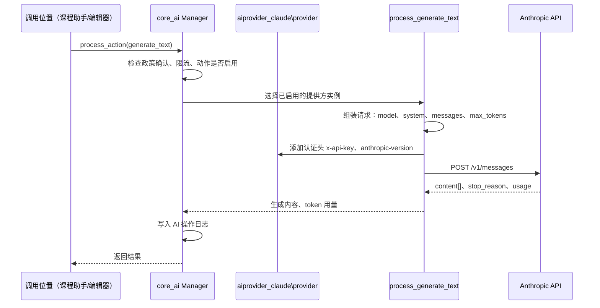

| 类 / 文件 | 职责 |
| --- | --- |
| `provider` | 声明支持的动作；添加认证头；判断是否已配置密钥 |
| `abstract_processor` | 发送 HTTP 请求；统一处理错误码（401、429、529 等） |
| `process_generate_text` | 构造 Messages API 请求；合并多段文本回复；记录 token 用量 |
| `process_summarise_text`、`process_explain_text` | 复用生成逻辑，使用各自的系统指令 |
| `aimodel\claude_sonnet_5` 等 | 可选模型（Sonnet 5、Opus 5.5、Haiku 4.5）及 temperature、max\_tokens 设置 |
| `hook_listener` | 在后台表单中加入 API 密钥和模型设置项 |
| `privacy\provider` | 声明发往外部服务的数据项，满足 Moodle 隐私 API |
| `lang/en`、`lang/zh_cn` | 英文和简体中文界面文字 |

用户标识以 Moodle 生成的匿名 ID 放入 `metadata.user_id`，不发送姓名和学号。

### 5.2 AI 服务连接插件 `local_aiservice`

- **调用认证**：每次请求携带学校编号、匿名用户 ID、课程 ID、角色和时间戳，用学校独有密钥做 HMAC 签名；服务端拒绝 5 分钟以前的请求。
- **权限前置**：请求到达 AI 服务层之前，接口网关经适配层校验该用户的 Moodle capability（如 `block/aitutor:ask`、`local/aigrading:review`），AI 服务层只信任签名中的角色。
- **资料同步**：监听课程模块创建、更新、删除事件，把资料变更推送到入库队列。
- **学习行为**：选取登录、资源浏览、作业提交、测验完成、成绩更新等事件，转为 xAPI 语句批量推送。
- **降级**：AI 服务不可用时，页面显示“AI 助教暂时不可用”，不影响 Moodle 其他功能。

## 六、AI 服务层总览与智能体编排

AI 服务层是独立部署的 Python 服务，由一个编排器和多个业务模块组成；业务模块共用课程知识库、提示词库和模型网关。

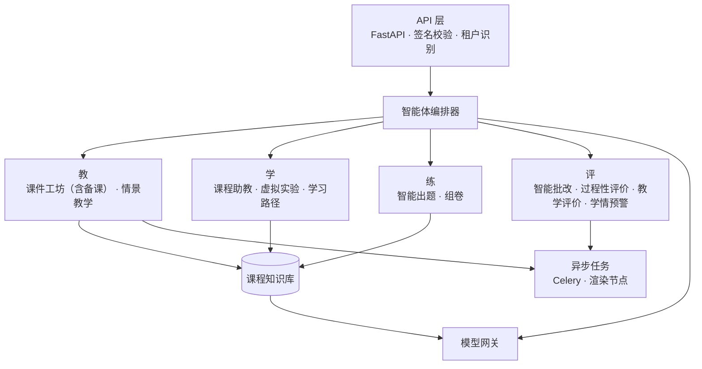

### 6.1 模块划分

| 模块 | 环节 | 调用方式 | 主要输出 | 详见 |
| --- | --- | --- | --- | --- |
| 智能课件工坊（含智能备课） | 教 | 异步（渲染）；单次课备课为同步 | 整门课设计、教案、交互动画、微课视频 | 第十二节、10.2 |
| 情景教学 | 教 / 学 | 同步多轮对话 | 角色对话、复盘评价 | 第十四节 |
| 课程助教 | 学 | 同步，流式返回 | 带出处的回答 | 第八节 |
| 虚拟实验 | 学 | 同步 + 操作记录 | 仿真实验、实验诊断 | 第十三节 |
| 个性化学习路径 | 学 | 每日更新 + 按需查询 | 下一步复习内容与练习、推荐理由 | 11.3 |
| 智能出题与组卷 | 练 | 同步 | 题目、答案、解析、试卷 | 10.1 |
| 智能批改 | 评 | 异步批量 | 建议分、依据、反馈草稿 | 第九节 |
| 学情分析与预警 | 评 | 定时计算 | 掌握度、预警及依据 | 第十一节 |
| 学生过程性评价 | 评 | 定时汇总 | 成长档案、能力画像、评语草稿 | 第十五节 |
| 教学评价 | 评 | 学期末 / 按需 | 教师发展报告 | 第十六节 |

### 6.2 智能体编排器

编排器把每个请求处理为一条固定的步骤链，每一步都可追踪：

1. **识别意图**：判断问题属于概念讲解、作业求助、课程事务（考试时间等）还是无关问题。
2. **应用规则**：读取教师为课程和作业设定的 AI 使用规则（禁止 / 允许辅助 / 完全开放）。
3. **检索资料**：从课程知识库取回相关片段。
4. **组装提示词**：从提示词库取对应版本的模板，填入资料和规则。
5. **调用模型**：经模型网关调用，按任务选择大模型或小模型。
6. **校验输出**：检查是否引用了检索到的资料、是否违反作业规则、是否符合输出格式；不合格则重试或返回“无法回答”。
7. **记录**：保存请求、检索结果、提示词版本、模型、耗时和用量，供审计和质量分析。

### 6.3 提示词库

- 提示词以文件形式保存在代码仓库，每次修改生成新版本号。
- 每个版本有对应的评测集（例如 50 道已知答案的课程问题、30 份已由教师评分的作业），发布前自动评测，准确率不下降才能上线。
- 院校可覆盖部分模板，例如助教的语气和称呼。

## 七、课程知识库（RAG）

课程知识库把教师放入课程的资料转成可检索的片段，是助教“只依据课程资料回答”和“注明出处”的基础。向量化在本地完成，资料全文不发送给外部模型。

### 7.1 资料入库流程

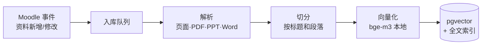

| 步骤 | 处理内容 |
| --- | --- |
| 资料来源 | Moodle 页面、标签、文件资源（PDF、PPT、Word）、作业说明、教师标记为“精选”的讨论区帖子 |
| 解析 | 提取正文和标题层级；扫描件用 OCR；公式保留 LaTeX；表格转为文本 |
| 切分 | 按标题和段落切分，每片 300–800 字，相邻片段重叠约 15%；每片记录所属文件、章节、页码 |
| 向量化 | 本地 bge-m3 模型；同时建立中文分词全文索引 |
| 存储 | 按学校 + 课程分区；资料删除或修改后，对应片段同步删除或更新 |
| 可见性 | 尊重 Moodle 的资料可见设置：隐藏或尚未开放的资料不被学生检索到 |

### 7.2 检索流程

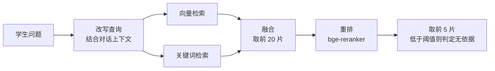

- **混合检索**：向量检索擅长语义相近，关键词检索擅长术语和代码名，两者融合后再重排。
- **无依据判定**：重排分数都低于阈值时，助教回答“课程资料中没有找到依据”，并可转给教师。阈值在试点中用评测集校准。
- **出处链接**：每个片段带有 Moodle 资源链接和页码，回答中的引用可直接点开原文。

## 八、课程 AI 助教模块

助教出现在网页和小程序的课程页中，只依据本课程资料回答、注明出处，并按教师设定的规则处理作业题。

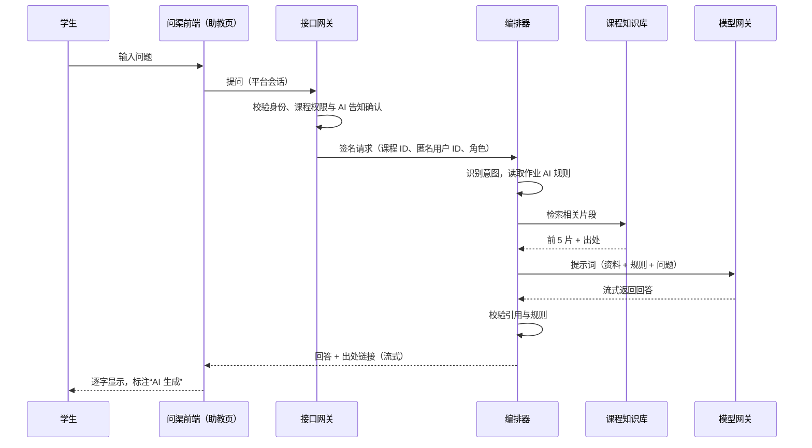

### 8.1 回答规则

| 问题类型 | 处理方式 |
| --- | --- |
| 概念讲解 | 根据检索到的资料解释，附出处；可举例、可追问 |
| 作业求助（规则：允许辅助） | 只给思路和引导性问题，不给完整答案或代码；可帮学生检查自己写的思路 |
| 作业求助（规则：禁止） | 告知该作业不允许使用 AI，建议找教师或助教 |
| 课程事务 | 从课程公告和日历中查找；找不到则说明 |
| 资料中无依据 | 明确说明没有依据，不猜测；可一键转到课程讨论区或教师 |
| 与课程无关或违规 | 礼貌拒绝，引导回课程内容 |

### 8.2 教师端功能

- 开关：按课程开启或关闭助教，按作业设定 AI 使用规则。
- 高频问题：按周汇总学生提问主题，不显示提问人身份。
- 纠错：教师可标记错误回答并给出正确说法，进入课程知识库的“教师补充”资料。
- 学生反馈：每条回答有“有帮助 / 有错误”按钮，数据进入质量报表。

## 九、智能批改模块

批改模块按教师制定的评分量规逐项给出建议分和依据，教师审核后写入 Moodle 成绩册；AI 建议不会直接对学生可见。

### 9.1 处理流程

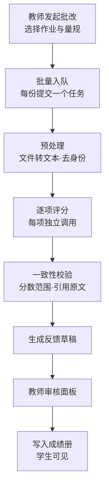

- **逐项评分**：量规的每一项单独调用模型，要求返回分数、理由和引用的原文句子；引用的句子必须能在提交中找到，否则重试。
- **编程作业**：先在隔离容器中运行教师提供的测试用例，测试结果作为评分依据之一。
- **校准**：教师先人工评分 5–10 份，系统将其作为样例放入提示词，并计算 AI 与教师评分的差异，差异过大时提醒教师逐份复核。
- **模型选择**：批改默认用能力较强的模型和低随机度，保证同一份提交多次评分结果接近。

### 9.2 批改记录状态机

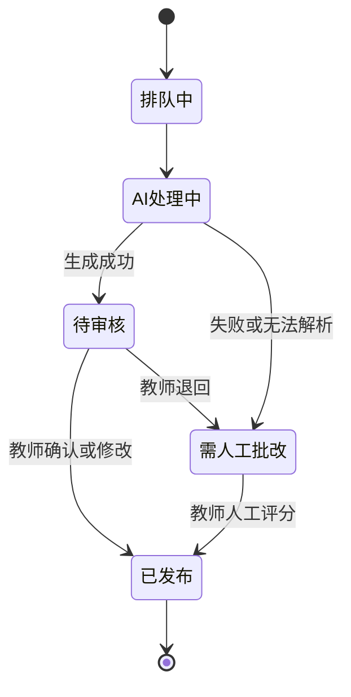

教师对建议分的每一处修改都会记录，用于衡量 AI 批改的准确率并改进提示词。

## 十、智能出题与单次课备课

出题和备课都以课程知识库为素材，生成内容先进入草稿区，教师编辑确认后才进入题库或课程。单次课备课是智能课件工坊（第十二节）的快速入口，与课件工坊计为同一模块。

### 10.1 智能出题

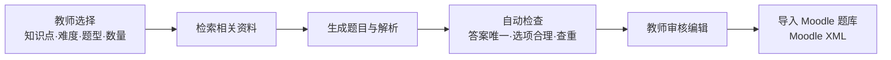

| 项目 | 说明 |
| --- | --- |
| 题型 | 单选、多选、判断、填空、简答、编程题（附测试用例） |
| 标注 | 每题标注知识点、难度、出处片段，写入 Moodle 题目标签 |
| 查重 | 与课程题库已有题目做相似度比对，过于相似的题目提示教师 |
| 题目质量分析 | 考试后用 Moodle 测验统计（难度系数、区分度）反馈到出题模块 |
| 组卷 | 按知识点覆盖和难度分布自动组卷，生成 Moodle 测验 |

### 10.2 单次课备课（课件工坊的快速入口）

- **输入**：教学大纲、本次课时主题、课时长度、上轮学情（如“递归终止条件”掌握度偏低）。
- **输出**：教案提纲、引入案例、课堂讨论题、随堂小测、课后练习。
- **一键搭建**：教师确认后，在 Moodle 课程中生成对应章节、页面和测验。
- **用学情驱动**：备课时自动展示上周助教高频问题和薄弱知识点，建议课堂重点。

## 十一、学情分析、预警与个性化学习路径

学情模块每天汇总学习行为和成绩，计算知识点掌握度和学业风险；每条预警都列出依据，是否干预由教师或辅导员决定。

### 11.1 数据管道

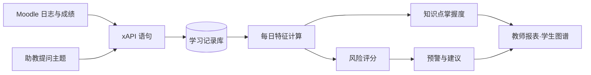

### 11.2 指标与预警规则

| 指标 | 计算方式 | 用途 |
| --- | --- | --- |
| 知识点掌握度 | 按题目的知识点标签汇总测验与作业得分率，近期成绩权重更高 | 学生掌握度图谱、全班薄弱点 |
| 学习投入 | 登录天数、资源浏览、按时提交率 | 发现投入持续下降的学生 |
| 成绩趋势 | 连续测验得分变化 | 发现成绩明显下滑 |
| 提问主题 | 助教问题归类到知识点（只用主题，不用原文） | 判断困难所在 |

预警分两步建设：

1. **试点期用规则**：例如“连续 2 次作业未提交”“最近两次测验均低于及格线且下降超过 15 分”“14 天未登录”。规则透明，教师可调整阈值。
2. **积累一学期数据后引入模型**：用历史数据训练可解释的风险模型（如梯度提升树），输出影响最大的几项因素作为预警依据；上线前需评估误报率并检查不同群体间是否公平。

**可见范围**：学生只看到自己的掌握度和学习建议，看不到“风险”标签；教师看所教课程；辅导员看所带班级；院校管理者默认只看汇总数据。

### 11.3 个性化学习路径

学习路径根据知识点图谱和每个学生的掌握度，推荐下一步复习什么、练什么；推荐只作参考，学生可以不采纳。

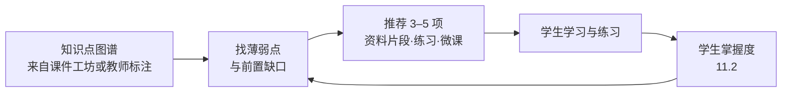

| 项目 | 设计 |
| --- | --- |
| 推荐规则 | 先补掌握度最低的前置知识点，再练当前单元；每项推荐附理由，如“第 4 章递归依赖本知识点” |
| 推荐内容 | 课程知识库中的对应资料片段（带出处）、对应知识点和难度的练习题、相关微课与交互动画 |
| 练习题来源 | 优先用已审核入库的题目；题量不足时由出题模块生成，教师审核后才进入推荐 |
| 学生视图 | 在掌握度图谱上显示“下一步”；可向 AI 助教追问推荐理由 |
| 教师视图 | 查看全班推荐分布，可屏蔽或置顶某些内容 |
| 建设节奏 | 试点期用规则推荐；积累一学期数据后，再评估是否引入学习模型 |

## 十二、智能课件工坊

课件工坊把教师上传的大纲和教材变成整门课的设计、每节课的教案、交互动画和讲解微课。大模型负责规划内容、写讲稿和写动画代码，画面、配音和视频由渲染引擎、语音合成和合成工具完成。

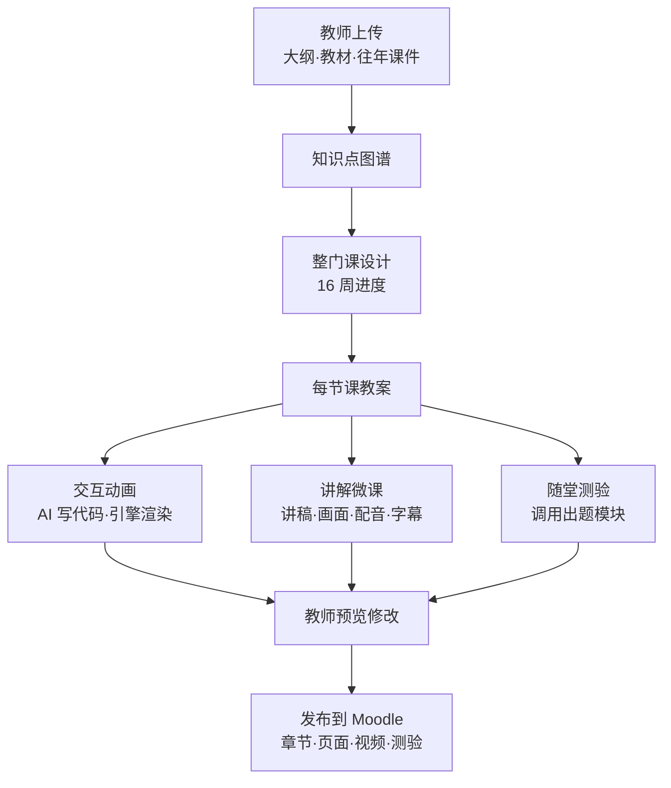

### 12.1 整门课与每节课设计

| 层次 | 输出 | 说明 |
| --- | --- | --- |
| 课程 | 知识点图谱、课程目标与毕业要求对应表、周进度 | 按学时和知识点前后依赖关系安排 |
| 单元 | 单元目标、重难点、单元测验 | 每个单元对应一组知识点 |
| 课时 | 教学目标、按分钟排的课堂流程、案例、讨论题、随堂测、课后作业 | 参考上周学情调整重点 |

设计只依据教师自己的资料，并保留教师的教学风格模板；每一项都要教师确认后才发布。

### 12.2 交互动画

| 形式 | 引擎 | 适用 |
| --- | --- | --- |
| 网页交互动画 | HTML + SVG / Canvas | 算法过程、流程、可点击的分步演示 |
| 数学与理工动画 | Manim | 公式推导、函数图像、几何与物理过程 |
| 图表动画 | 数据可视化库 | 统计、经济数据随时间变化 |

AI 生成的是动画代码，渲染在隔离容器中执行；公式、数据和步骤由程序精确绘制，教师用自然语言提修改意见即可重新生成。

### 12.3 讲解微课视频

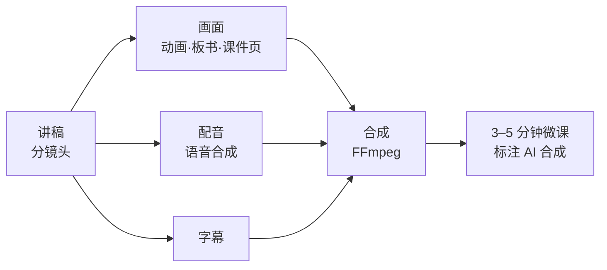

| 视频类型 | 做法 | 用途与限制 |
| --- | --- | --- |
| 讲解微课 | 讲稿 + 程序渲染的画面 + 语音合成 + 字幕，全自动 | 知识讲解的主力形式，内容准确 |
| 情境导入短片 | 已备案的文生视频模型生成 5–10 秒画面 | 只用于营造情境，不承载知识内容（易画错文字和图表） |
| 数字人讲解 | 教师本人形象或声音克隆 | 必须有教师书面授权；按深度合成管理规定显著标识 |

语音合成优先用校内部署的开源中文语音模型，或国内云语音服务；渲染和合成作为异步任务运行在 GPU/CPU 任务节点上。

## 十三、AI 虚拟仿真实验模块

虚拟实验按三类仿真内核建设：浏览器端实时仿真（AI 生成的网页实验、MuJoCo 机器人实验）、服务器端 ROS 2 容器、外部高保真平台接入。AI 实验助手读取统一格式的过程遥测，贯穿全部实验；实验记录和成绩统一回到教学引擎，并可上报“实验空间”国家平台。

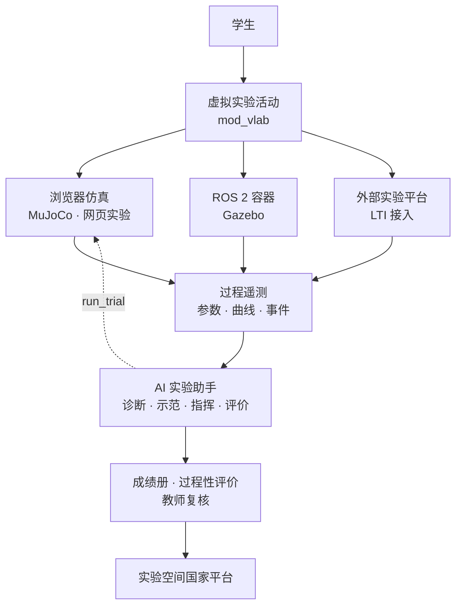

| 层次 | 内容 | 说明 |
| --- | --- | --- |
| AI 生成网页实验 | 电路搭建、力学、滴定曲线、算法与数据结构、统计抽样等 | 教师描述实验目标与参数，AI 生成仿真代码；物理与化学计算使用校验过的计算模块，教师预览确认后发布 |
| 外部平台接入 | 国家虚拟仿真实验教学课程共享平台、厂商 3D 实验 | 通过 LTI 或链接接入；支持成绩回传的平台自动同步成绩 |
| AI 实验助手 | 随时提问、按操作记录判断错误步骤、实验报告反馈草稿 | 实验报告反馈走智能批改流程，教师审核后发布 |
| 机器人与控制仿真 | 倒立摆、机械臂、巡线小车、路径规划、SLAM、抓取（见 13.1） | 浏览器 MuJoCo 与 ROS 2 容器两档；AI 可直接调用仿真做示范实验 |

**记录的操作数据**：步骤顺序、参数设置、尝试次数、用时、最终结果。这些数据进入学生过程性评价（第十五节）的“实践能力”维度。

### 13.1 机器人与控制仿真实验包

首批 6 个实验，覆盖自动控制和机器人主干课；倒立摆和机械臂两个已有可运行样品（[AI 机器人虚拟仿真实验室](https://claude.ai/artifact/BAijudM2KQqQjy54GwRaZ5)）。

| 实验 | 对应课程 | 知识点 | 仿真内核 | 状态 |
| --- | --- | --- | --- | --- |
| 倒立摆 PID 控制 | 自动控制原理 | P、I、D 作用，位置环，抗扰动 | 浏览器 | 样品已完成 |
| 二连杆机械臂运动学 | 机器人学导论 | 正逆运动学、可达空间、奇异位形、插值方式 | 浏览器 | 样品已完成 |
| 巡线小车 | 机器人基础、嵌入式 | 传感器读数、差速控制 | 浏览器 | 下一批 |
| 路径规划 | 数据结构、人工智能 | A\*、Dijkstra 搜索过程 | 浏览器 | 下一批 |
| SLAM 与导航 | 移动机器人 | 建图、定位、导航 | ROS 2 容器 | 进阶 |
| 抓取与放置 | 机器人学、课程设计 | MoveIt 2 运动规划 | ROS 2 容器 | 进阶 |

| 项目 | 基础档：浏览器仿真 | 进阶档：ROS 2 容器 |
| --- | --- | --- |
| 仿真内核 | MuJoCo（WebAssembly 版，Apache 2.0） | Gazebo + ROS 2（Apache 2.0） |
| 运行位置 | 学生浏览器或小程序 web-view | 服务器容器，每人一个，画面推到浏览器 |
| 服务器成本 | 几乎为零，千人同时实验不增加负载 | 按并发容器计算，视觉类实验可选 GPU 节点 |
| 适合 | 大班必修课、课前预习 | 机器人、自动化专业的课程设计 |
| 计费 | 包含在平台内 | 按使用时长计费，云服务增值项 |

### 13.2 AI 在实验中的四个角色

AI 不替学生做实验：诊断只指方向，示范要学生先试满 3 次才解锁，评价由教师复核。

| 角色 | 输入 | 输出 | 约束 |
| --- | --- | --- | --- |
| 现象诊断 | 本次曲线（每 0.25 s 采样）、全部尝试记录 | 现象、原因、调整方向、引导问题 | 不给具体数值，不给参考答案 |
| 示范调参 | 学生已做的尝试 | AI 通过工具 `run_trial` 真实运行仿真，最多 5 次，每次先说明假设 | 学生先试满 3 次才解锁 |
| 自然语言指挥 | 学生指令、机械臂当前状态 | 运动计划：移动、直线、圆、多边形 | 可达性由系统检查，不可达点标红；AI 只规划和解释 |
| 过程性评价 | 尝试序列、参数改动、AI 使用情况、实验心得 | 四个维度 1–5 分和百分制，附给教师的备注 | 教师复核后计入成绩；并入第十五节的证据 |

模型不可用时，实验自动切到离线规则版：诊断和评价按规则生成，实验本身不受影响。所有模型调用经模型网关，使用已备案模型。

### 13.3 遥测接口与仿真验证

仿真内核与 AI 之间只传两类数据：参数（控制器增益、运动指令）和遥测（时间序列、事件、指标）。格式统一后，换内核不影响 AI 模块。

```json
{
  "experiment": "cartpole-pid",
  "attempt": 3,
  "params": {"Kp": 60, "Ki": 0, "Kd": 8, "pos": true, "Kx": 3, "Kv": 4.5},
  "metrics": {"ok": true, "maxAngDeg": 14.6, "settleS": 0.52, "oscillations": 1, "recoverS": 2.0, "maxXm": 0.43},
  "trace": [[0.25, 2.1, 0.03], [0.5, -0.4, 0.05]],
  "events": [{"t": 5.0, "type": "disturbance"}]
}
```

**仿真验证**：样品的倒立摆动力学方程与 MuJoCo 3.4 在同一初始条件和同一外力下逐步对照（2 s，4000 步，RK4），摆角最大差异在浮点误差量级（2.2×10⁻¹⁶ rad）。正式版基础档直接使用 MuJoCo WebAssembly 版本，每个新实验上线前都做同样的对照。

**对接“实验空间”**：按国家虚拟仿真实验教学课程共享平台公布的接口规范上报实验数据，对接时以平台最新规范为准。

## 十四、情景教学模块（AI 角色扮演）

AI 按教师设定扮演情景中的角色，学生在对话中完成任务；结束后 AI 按评分标准复盘，教师可查看全部对话。以 Moodle 活动插件 `mod_aiscenario` 实现。

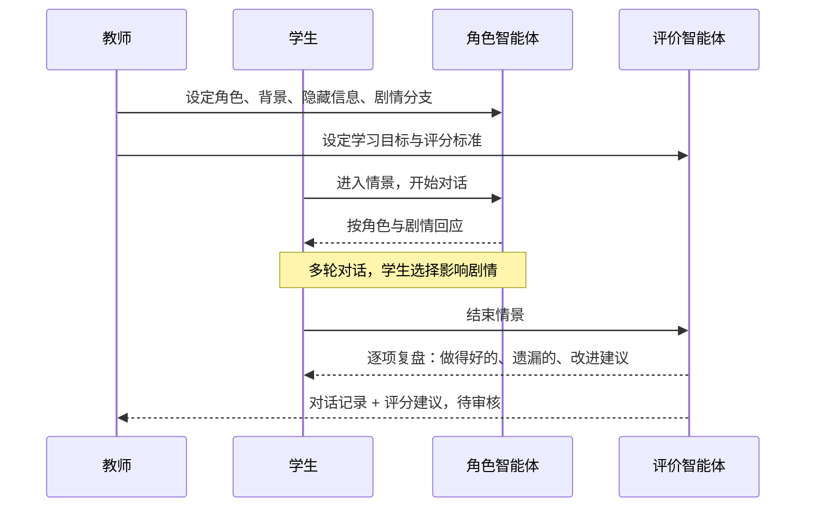

### 14.1 情景定义

| 要素 | 说明 | 护理问诊示例 |
| --- | --- | --- |
| 角色 | 身份、性格、说话方式 | 58 岁男性，紧张，话少 |
| 公开背景 | 学生进入前看到的信息 | 主诉胸闷半天 |
| 隐藏信息 | 只有问到才透露的信息 | 有高血压史、吸烟 30 年 |
| 剧情分支 | 学生选择导致的不同走向 | 未安抚情绪则患者更抗拒 |
| 学习目标 | 希望学生完成的任务 | 完整采集病史、识别危险信号 |
| 评分标准 | 复盘依据 | 问诊完整性、沟通技巧、人文关怀 |

### 14.2 设计要点

- **两个智能体分工**：角色智能体只负责演好角色，不给提示；评价智能体只在结束后评价，避免入戏与评价混杂。
- **守住设定**：角色不透露未被问到的隐藏信息，不跳出角色；学生输入与情景无关或不当时礼貌拉回。
- **依据可靠**：历史人物访谈类情景挂接教师提供的史料知识库，超出史料的问题以角色口吻说明“没有记载”。
- **多模态**：外语情景支持语音输入与语音回复，并评价发音与流利度。
- **情景库**：教师可共享和复用情景，形成校级情景库。

## 十五、学生过程性评价模块

过程性评价把学生在平台上的全部学习证据汇成成长档案，按教师设定的能力维度生成画像；最终成绩和评语由教师决定。

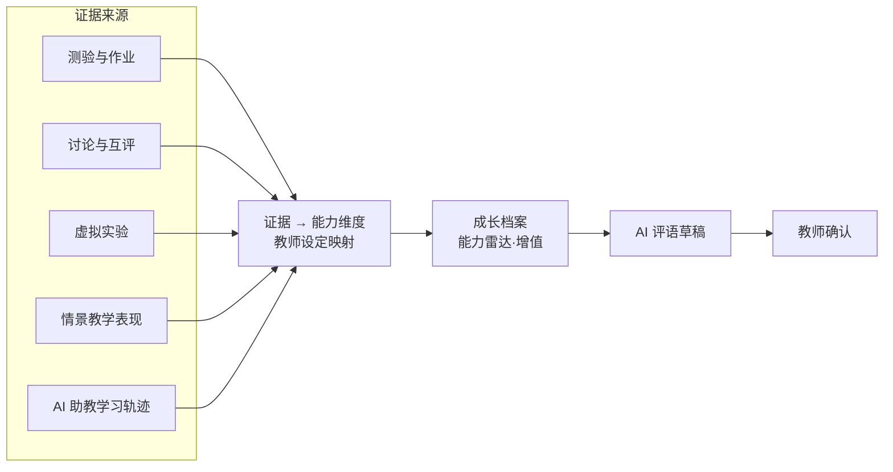

| 功能 | 说明 |
| --- | --- |
| 能力维度 | 默认知识掌握、实践操作、表达沟通、协作、创新五项；可对应专业毕业要求（工程教育认证）重新定义 |
| 证据映射 | 教师指定每项活动计入哪些维度及权重，例如“情景问诊 → 沟通 60%、实践 40%” |
| 增值评价 | 对比学期初诊断测验与期末表现，展示进步幅度 |
| AI 评语 | 按全过程数据起草个性化评语，注明依据的活动；教师修改确认 |
| 学生视图 | 学生可看自己的档案、每项得分的依据和改进建议 |
| 导出 | 按学期导出为 PDF 成长报告，归入学生档案 |

**原则**：只采集与学习直接相关的数据；评价依据对学生公开；助教对话只以“提问主题”计入，不评判提问内容本身，避免学生不敢提问。

## 十六、教学评价模块

教学评价定位为帮助教师改进教学的工具，报告默认只给教师本人，不用于考核排名；课堂分析必须经教师同意。

```mermaid
flowchart LR
    A["学生评教<br/>评分与留言"] --> R["教师发展报告"]
    B["课程数据<br/>正确率·活跃度·高频问题"] --> R
    C["课堂录音转写<br/>需教师同意"] --> R
    R --> T["教师本人"]
    R -. 教师同意后 .-> G["教研室·教发中心"]
```

| 分析项 | 方法 | 输出 |
| --- | --- | --- |
| 评教留言 | 大模型归纳主题与态度，附代表性原话 | “节奏偏快（32 条）”“案例贴近实际（45 条）”等 |
| 课程数据 | 按章节汇总作业正确率、资料浏览、助教高频问题 | 学生普遍卡住的章节及改进建议 |
| 课堂分析 | 录音转文字后分析提问类型、师生话语比例、讲授与讨论时间分配 | 课堂结构图与对比（与自己上学期比较） |
| 改进追踪 | 教师选定改进目标，下学期自动对比 | 改进效果曲线 |

**数据与权限**：评教分析不识别具体学生；课堂录音转写后只保留文字与分析结果，录音按策略删除；报告共享范围由教师本人决定。这些规则需在试点前与校方、教师代表共同确认。

## 十七、模型网关

模型网关是所有模型调用的唯一出口，对内提供 OpenAI 兼容接口，对外适配各家模型；合规、成本和可用性都在这一层控制。

```mermaid
sequenceDiagram
    participant C as 调用方（AI 服务层 / Moodle）
    participant G as 模型网关
    participant F as 内容安全
    participant M as 大模型
    C->>G: 请求（学校密钥、任务类型、消息）
    G->>G: 鉴权、额度与限流检查
    G->>G: 去标识：姓名、学号、手机号 → 占位符
    G->>F: 输入内容安全检测
    G->>M: 按路由规则转发
    M-->>G: 生成结果
    G->>F: 输出内容安全检测
    G->>G: 还原占位符（如需）、记录审计与用量
    G-->>C: 返回结果
```

| 功能 | 设计 |
| --- | --- |
| 统一接口 | 对内暴露 `/v1/chat/completions` 和 `/v1/embeddings`（OpenAI 兼容）；Moodle 原生 AI 功能通过 `aiprovider_ailms` 接入 |
| 路由 | 按学校、任务类型选择模型：助教问答用响应快的模型，批改用能力强的模型，涉及敏感数据的任务只走校内私有模型 |
| 故障切换 | 主模型超时或报错时按配置切换到备用模型；连续失败触发熔断并告警 |
| 去标识 | 规则 + 名单匹配（课程选课名单中的姓名、学号），替换为“学生#A7”类占位符；映射表只保存在网关内存中，请求结束即销毁 |
| 内容安全 | 输入输出双向检测：本地敏感词库 + 国内云内容安全服务；命中时拦截并记录 |
| 限流与额度 | 按学校、按用户、按小时限流；按学校设月度 token 额度，达到 80% 时提醒管理员 |
| 审计 | 记录调用时间、学校、匿名用户、任务类型、模型、token 用量、耗时、内容安全结果；请求原文按策略保留或不保留 |
| 计量 | 按学校和功能汇总成本，支撑云服务计费 |
| 缓存 | 课程内高频相同问题的回答短时缓存，降低成本 |
| 开源基础 | 可基于开源网关（如 LiteLLM）扩展去标识和内容安全模块，减少重复开发 |

| 部署位置 | 可用模型 |
| --- | --- |
| 中国大陆 | 已备案模型（DeepSeek、通义千问等）；校内私有开源模型 |
| 海外（演示、国际项目） | Claude 等 |

## 十八、数据架构

教学数据留在 Moodle 数据库，AI 服务层只保存它自己生成和需要的数据，并且所有表都带学校编号，按学校隔离。

### 18.1 存储划分

| 存储 | 内容 | 技术 |
| --- | --- | --- |
| Moodle 数据库 | 用户、课程、作业、成绩、日志、AI 操作日志 | PostgreSQL 16 |
| Moodle 文件区 | 课件、提交的文件 | 本地磁盘或对象存储 |
| AI 服务数据库 | 资料片段与向量、助教对话、批改记录、学习记录、掌握度与预警 | PostgreSQL 16 + pgvector |
| 缓存与队列 | 会话、缓存、异步任务队列 | Redis 7 |
| 审计库 | 模型调用审计、内容安全记录 | 独立数据库，只追加不修改 |

### 18.2 AI 服务主要数据表

| 表 | 主要字段 |
| --- | --- |
| `kb_chunk` | 学校、课程、来源资源、章节、页码、文本、向量、可见性、更新时间 |
| `tutor_message` | 学校、课程、匿名用户、问题、回答、引用片段、意图、评价、模型、提示词版本 |
| `grading_job` / `grading_item` | 作业、提交、量规项、建议分、依据、引用原文、状态、教师最终分 |
| `learning_record` | 匿名用户、行为、对象、结果、时间（xAPI 格式） |
| `mastery` / `alert` | 知识点掌握度；预警等级、依据、处理状态、处理人 |

### 18.3 数据分级与流向

| 级别 | 例子 | 能否发往外部模型 |
| --- | --- | --- |
| 敏感个人信息 | 身份证号、手机号、家庭信息 | 不进入 AI 服务层 |
| 个人信息 | 姓名、学号、成绩 | 去标识后才能发送 |
| 教学内容 | 课件、作业要求、题目 | 按需发送相关片段，不发送整门课资料 |
| 学生作品 | 作业提交、助教提问 | 去标识后发送；学校可设定只用校内模型 |

**保留期限**（默认值，学校可调）：助教对话 1 年；批改记录跟随成绩保留；审计日志不少于 6 个月；学生毕业或注销后按 Moodle 隐私流程删除或匿名化。

## 十九、安全与合规架构

安全按网络、应用、数据、AI 四层设计，云服务版本按网络安全等级保护三级建设。

```mermaid
flowchart LR
    I[互联网] --> W["WAF / HTTPS<br/>负载均衡"]
    W --> Z1["应用区<br/>Moodle · AI 服务"]
    Z1 --> Z2["数据区<br/>数据库 · 缓存 · 文件"]
    Z1 --> GW["模型网关<br/>唯一出向通道"]
    GW --> EX["已备案模型 API"]
```

数据区不连互联网；应用区只有模型网关可以向外访问，并且只允许访问白名单中的模型地址。

| 层面 | 措施 |
| --- | --- |
| 网络 | HTTPS 全站；WAF；应用区与数据区分离；出向白名单 |
| 身份与权限 | 学校统一身份；管理员双因素认证；Moodle 权限 + AI 服务签名校验；最小权限 |
| 数据 | 数据库与备份加密；密钥存放在密钥管理服务中；每日备份、异地保存，定期恢复演练 |
| AI 特有 | 去标识；输入输出内容安全；防提示词注入（课程资料与指令分区、不执行资料中的指令）；AI 生成内容标识 |
| 审计 | 管理操作、模型调用、数据导出全部记录；审计库只追加不修改 |
| 运维 | 漏洞扫描与定期渗透测试；跟随 Moodle 安全更新及时升级 |

**合规对应**

| 要求 | 对应设计 |
| --- | --- |
| 《生成式人工智能服务管理暂行办法》 | 只调用已备案模型；应用向属地网信办登记；页面公示模型名称与备案号 |
| 《人工智能生成合成内容标识办法》 | 所有 AI 生成内容在界面上标识 |
| 《个人信息保护法》 | 告知同意、最小化采集、去标识、保留期限 |
| 《数据安全法》 | 数据分级；全部数据境内存储与处理 |
| 网络安全等级保护 | 云服务版本按三级建设测评；私有部署纳入学校现有等保体系 |

## 二十、部署架构

同一套容器镜像支持三种部署模式；试点阶段建议云服务版本，推广后可迁回校内。

### 20.1 云服务多租户架构

```mermaid
flowchart TD
    LB["负载均衡 / WAF<br/>按域名分流"] --> NA["学校 A 命名空间<br/>Moodle + 数据库"]
    LB --> NB["学校 B 命名空间<br/>Moodle + 数据库"]
    LB --> NC["学校 C 命名空间<br/>Moodle + 数据库"]
    NA --> AI["共享 AI 服务层<br/>按学校编号隔离"]
    NB --> AI
    NC --> AI
    AI --> GW[共享模型网关]
    OPS["运营平台<br/>开通·升级·计费·监控"] -.-> NA
    OPS -.-> AI
```

- **每校独立**：每所学校在 Kubernetes 中有独立命名空间、独立的 Moodle 和数据库，可用学校自己的域名和主题。
- **AI 共享**：AI 服务层和模型网关多校共用；数据表带学校编号，数据库行级安全策略确保查询不跨校。
- **运营平台**：新学校用模板自动开通；滚动升级，先升级一所学校观察后再全量。

### 20.2 三种部署模式

| 模式 | 运行位置 | 典型配置 | 适合 |
| --- | --- | --- | --- |
| 云服务 | 国内公有云，项目方运营 | 多校共用 Kubernetes 集群 | 试点、运维力量有限的学校 |
| 校内私有部署 | 学校数据中心 | 小规模单机 Docker；全校规模 Kubernetes + GPU 服务器运行本地模型 | 数据要求最严、有运维团队 |
| 混合部署 | Moodle 在校内，AI 服务在云端 | 校内到云端的加密专线或 VPN | 已有 Moodle 或希望平台留在校内 |

### 20.3 v0.1 部署包（已实现）

```mermaid
flowchart LR
    U[浏览器] --> MO["moodle<br/>PHP 8.3 + Apache"]
    MO --> DB[("db<br/>PostgreSQL 16")]
    MO --> RD[("redis<br/>会话缓存")]
    CR["cron<br/>每分钟定时任务"] --> DB
    MO --> API["Claude / DeepSeek API"]
```

| 服务 | 说明 |
| --- | --- |
| `moodle` | Moodle 5.2 + Claude 提供方插件 + 中文语言包；启动时自动生成配置、安装或升级数据库、按环境变量配置 AI |
| `db` | PostgreSQL 16，数据持久化在 Docker 卷 |
| `redis` | 会话存储 |
| `cron` | Moodle 定时任务 |

v0.1 中 Moodle 直接调用模型 API；试点前增加 AI 服务层和模型网关两个容器后，即成为 20.1 的完整架构。

## 二十一、主要接口清单

AI 服务层提供 REST 接口，调用方为接口网关（代表问渠前端）和 Moodle 侧的连接插件，所有请求带学校编号和 HMAC 签名；模型网关对内提供 OpenAI 兼容接口。

| 接口 | 方法 | 调用方 | 说明 |
| --- | --- | --- | --- |
| `/api/v1/tutor/ask` | POST（流式） | 接口网关（助教页） | 提问，返回回答与出处 |
| `/api/v1/tutor/feedback` | POST | 接口网关（助教页） | 学生对回答的评价 |
| `/api/v1/kb/sync` | POST | 连接插件 | 资料新增、修改、删除通知 |
| `/api/v1/kb/status` | GET | 接口网关（教师设置页） | 课程资料入库进度 |
| `/api/v1/grading/jobs` | POST | 接口网关（批改页） | 发起一批批改 |
| `/api/v1/grading/jobs/{id}` | GET | 接口网关（批改页） | 查询进度与结果 |
| `/api/v1/grading/items/{id}/review` | POST | 接口网关（批改页） | 教师确认、修改或退回 |
| `/api/v1/questions/generate` | POST | 接口网关（出题页） | 生成题目，返回 Moodle XML |
| `/api/v1/lessons/draft` | POST | 接口网关（备课页） | 生成教案草稿 |
| `/api/v1/paths/{user}/next` | GET | 接口网关（学习页） | 个性化学习路径推荐及理由 |
| `/api/v1/xapi/statements` | POST | 连接插件 | 批量写入学习记录 |
| `/api/v1/insights/course/{id}` | GET | 接口网关（学情页） | 课程掌握度与预警列表 |
| `/api/v1/alerts/{id}` | PATCH | 接口网关（学情页） | 更新预警处理状态 |
| `/v1/chat/completions` | POST | AI 服务层、`aiprovider_ailms` | 模型网关：文本生成 |
| `/v1/embeddings` | POST | AI 服务层 | 模型网关：向量化 |
| `/lti/launch` 等 | LTI 1.3 | 其他学习平台 | 外部平台接入 AI 助教 |

保留 Moodle 原生界面的学校，上表中“接口网关”一列的调用方改为对应的 Moodle 插件（助教区块、批改面板、题库插件、报表插件），接口不变。

**助教提问请求示例**

```json
{
  "tenant": "school-a",
  "course_id": 201,
  "user": "anon-7f3a",
  "role": "student",
  "question": "递归为什么会栈溢出？",
  "conversation_id": "c-1029"
}
```

**返回示例**

```json
{
  "answer": "每次函数调用都会在调用栈上压入一帧……",
  "sources": [
    {"title": "讲义 4.2 递归的终止条件", "url": "/mod/page/view.php?id=88", "page": 3}
  ],
  "intent": "concept",
  "model": "deepseek-chat",
  "ai_generated": true
}
```

## 二十二、非功能设计目标

以下是设计目标，不是实测结果；试点期间将逐项压测验证，并按实测调整。

| 类别 | 目标 |
| --- | --- |
| 规模（单校） | 3 万注册用户；高峰 3000 人同时在线 |
| 助教响应 | 首字返回 3 秒内；完整回答 15 秒内（受模型服务影响） |
| 批量批改 | 一个 100 人班的作业在 30 分钟内完成 AI 预批改 |
| 资料入库 | 教师上传资料后 10 分钟内可被助教检索 |
| 可用性 | 教学平台月可用率 99.9%；AI 服务故障不影响 Moodle 基本教学功能 |
| 数据安全 | 每日全量备份；恢复点目标 ≤ 24 小时，恢复时间目标 ≤ 4 小时 |
| 扩展性 | Moodle 与 AI 服务均无状态，可水平扩展；异步任务按队列长度自动扩容 |
| AI 质量 | 助教回答经教师抽检准确率 ≥ 90%；AI 建议分与教师最终分差异在满分 10% 以内的比例 ≥ 80% |
| 可维护性 | 不改 Moodle 核心代码；Moodle 大版本发布后 3 个月内完成适配 |

## 二十三、实现状态与开发计划

v0.1 已完成平台底座和模型接入；试点前需完成助教与模型网关，批改和出题在试点学期内上线。

| 模块 | 状态 | 说明 |
| --- | --- | --- |
| Moodle 5.2 平台与一键部署包 | 已实现 | Docker Compose：Moodle、PostgreSQL、Redis、定时任务；安装流程已在全新数据库上验证，镜像尚待在服务器上首次构建 |
| Claude 提供方插件 | 已实现 | 海外演示用，国内部署包不安装；23 项单元测试通过；端到端调用流程已验证 |
| DeepSeek 接入 | 已实现 | Moodle 5.2 自带，部署包可自动配置 |
| 课程助手、编辑器 AI | 已启用 | Moodle 原生功能，经提供方插件调用模型 |
| 模型网关 + `aiprovider_ailms` | 试点前 | 路由、去标识、内容安全、审计、计量 |
| AI 服务层框架 + `local_aiservice` | 试点前 | 编排器、签名认证、事件推送 |
| 课程知识库 + AI 助教 | 试点前 | 试点核心功能 |
| 情景教学 | 试点前 | 样品已制作，待封装为 Moodle 活动插件 |
| 统一身份对接、主题 | 试点前 | 按试点学校的身份系统配置 |
| 智能出题与组卷 | 试点学期内 | 样品题库已导入 Moodle 验证格式 |
| 智能批改 | 试点学期内 | 先在 1–2 门课内验证准确率 |
| 智能备课与课件工坊 | 试点学期内 | 教案与交互动画先行，微课视频随后 |
| 虚拟实验 | 样品已完成，试点学期内上线 | 倒立摆、机械臂两个浏览器实验及 AI 诊断、示范调参、指挥、评价样品已完成；下一批巡线与路径规划，ROS 2 容器档随后 |
| 教务同步 | 学院推广阶段 | 依赖学校教务接口 |
| 学情分析与预警 | 学院推广阶段 | 先规则预警，积累数据后引入模型 |
| 学生过程性评价 | 学院推广阶段 | 试点期先积累证据数据 |
| 教学评价 | 学院推广阶段 | 规则与校方、教师代表共同确认后启用 |
| 多租户云服务与运营平台 | 全校与对外阶段 | 含等保三级测评 |
| LTI 1.3 对外接入 | 全校与对外阶段 | 服务使用其他平台的学校 |
| 微信内网页、微信登录与消息推送 | 试点前 | 学校已用企业微信时优先对接企业微信；界面样品已制作 |
| 微信小程序 | 学院推广阶段 | 主体注册与备案在试点期启动 |
| 品牌 App | 全校与对外阶段，按需 | 与网页、小程序同一套代码打包，改接国内推送 |
| 问渠前端（网页与小程序一套代码） | 试点前起步 | 先做课程、AI 助教、消息、情景练习；其余功能试点期间可暂用 Moodle 界面过渡 |
| 教学引擎适配层（Moodle 适配器） | 试点前 | Canvas 适配器按需开发 |
| 个性化学习路径 | 学院推广阶段 | 依赖知识点图谱和掌握度，先用规则推荐 |

### 待确认事项

- [ ] 试点学校的统一身份协议（CAS、OAuth2 或 LDAP）和教务系统接口形式
- [ ] 试点采用云服务还是校内部署，学校信息中心对数据存放的要求
- [ ] 私有部署、仅限本校使用时生成式 AI 登记的具体要求（与属地网信办确认）
- [ ] 校内是否有 GPU 资源，决定向量模型和私有大模型的部署位置

### 附：课程的生命周期（第 3 轮，2026-09-30）

开课 → 下架（`visible=0`，学生侧列表、目录都不出现，老师列表里标“已下架”）→ 删除（仅已下架的课；进 Moodle 分类回收站 `tool_recyclebin`，`categorybinexpiry=0` 不自动清空）→ 恢复（新课程 id，恢复后为下架状态，短名称复原）/ 永久删除。
- Moodle 插件 `local_wenquest_course_life`：delete / list / restore / purge / backup / binfile；表 `local_wenquest_trash` 记下删除时的授课老师，只有他们和站点管理员能看到和操作；备份文件放在用户自己的文件区，经 `local_wenquest_pluginfile` 只发给本人。
- 网关 `life_api.py`：下架/开课、删除、回收站、恢复（AI 建课项目的课程 id 与各章虚拟实验页重新对上）、永久删除（项目默认保留，可选一并删除）；下载在后台生成到 `data/exports/<用户>/`，签名链接 24 小时，文件留 3 天，完成发邮件。
