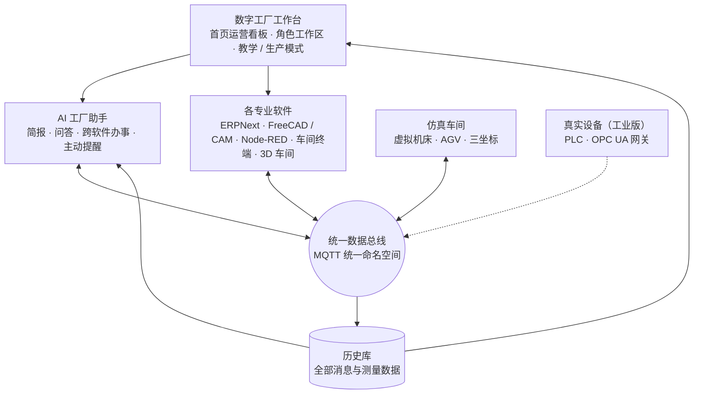

# 问渠数字工厂 · 实施细则 · 第 1 轮

2026-09-29 · 承接：《虚拟工厂/工厂设计》（ERPNext 减速器厂 WQR-105）、FreeCAD Lab、用户提供的参考方案（CAD–CAM–ERP–MES 集成）

> 状态：**第 1–8 步已完成，等第 9 步在你电脑上实测**（2026-09-29）。9 月 29 日加入 F5–F8；首页界面样稿已确认；施工中的补充决定见第九节，总线规范的补充见附录 A.5。

## 一、目标

数字工厂是**一个平台，两种用途**：
- **学习平台**：学生进入工厂，扮演计划员、工艺员、操作工、质检员、厂长，完成真实的生产任务；
- **工业版工作平台**：同一个平台就是一家工厂的日常工作台，员工在上面接单、设计、排产、加工、检验。

两种用途用同一套软件、同一条数据总线、同一个 AI。区别只在两处：教学模式有任务、指导和评分，机床是仿真的；生产模式没有提示，机床是真实设备。

## 二、三条原则

**原则一：AI 原生。** AI 不是某个软件里的一个按钮，而是整座工厂的“同事”：
- 它通过数据总线看到全厂的实时状态，能回答“SH-301 为什么还没完工”“这周瓶颈在哪台机床”，回答注明数据来源；
- 它能跨软件办事：一句话“安排 10 台减速器的生产”，它起草销售订单、运行 MRP、提出排产方案，**先给预览，人确认后才执行**；
- 它主动提醒：质检数据趋近公差、刀具寿命将尽、订单可能延期；
- 教学模式下它引导学生思考、不代做；生产模式下它帮员工把活干完。

**原则二：一个工厂平台，多种专业软件。** 用户从一个入口（数字工厂工作台）登录，首先看到工厂运营总览看板，再按角色进入自己的工作区，在里面打开 ERPNext、FreeCAD、Node-RED、车间终端、3D 车间等各种软件工作。软件各司其职，平台把它们组织成一座工厂。

**原则三：数据统一到统一数据总线。** 所有软件、设备、仿真机床和 AI 只和总线打交道，不互相直连：
- 采用工业界的“统一命名空间”做法：按“工厂 / 车间 / 产线 / 工位 / 设备”分层命名主题，每类消息有固定的 JSON 格式和版本号；
- 总线上的每条消息同时存入历史库，看板、报表、AI 都从同一个地方取数；
- 接入新软件或把仿真机床换成真实机床，只需接上总线，其他部分不改。

## 三、首页：工厂运营总览看板

进入数字工厂的第一屏就是全厂运营总览。所有数字都来自统一数据总线和历史库，实时刷新；点任何一项都能下钻到对应的软件或记录。

| 区域 | 内容 |
|---|---|
| AI 今日简报（顶部） | AI 用三五句话概括当前状况和需要关注的事，例如“磨床 G-01 是今天的瓶颈，SH-301 预计晚 1 天完工；45 钢库存只够 3 天”，每条附数据来源，可直接追问 |
| 关键指标 | 订单准时交付率、在制品数量、设备综合效率（OEE）、一次合格率、本周产量（计划 / 实际）、实际成本与标准成本偏差 |
| 车间实况 | 车间平面图上每台设备的状态（运行 / 空闲 / 停机 / 故障）、当前工单和进度；点开进入 3D 车间 |
| 订单与交期 | 在手订单按交期排列，显示进度和延期风险 |
| 生产计划与实际 | 今日、本周计划与完成对比；瓶颈工序 |
| 质量 | 合格率趋势、关键尺寸控制图（如轴径）、待处理不合格品 |
| 物料 | 关键物料库存与在途采购，低于安全库存的高亮 |
| 提醒与待办 | AI 与系统生成的提醒（趋近公差、刀具寿命、延期风险），按当前角色显示待办 |

**两种模式下的首页**：
- 教学模式：看板上方加一栏“当前任务”，显示学生所扮演角色的任务、进度和得分；看板本身就是学习材料，实验里会要求学生读懂指标并做决策；
- 生产模式：没有任务栏，首页就是厂长和各部门每天打开的运营总览。

**按角色的侧重**：首页对所有角色相同；厂长默认展开成本与交付，计划员默认展开订单与物料，质检员默认展开质量，操作工默认展开自己工位的派工。

## 四、架构



| 角色 | 选型 | 说明 |
|---|---|---|
| 工作台 | 自研网页（与问渠同一技术栈） | 首页运营看板、统一登录、角色工作区、模式切换、任务与评分（教学模式） |
| AI 工厂助手 | 问渠模型网关（美国用 Claude，国内用已备案模型） | 读取总线与历史库；生成今日简报；通过总线和各软件接口执行动作，写操作先预览后确认 |
| 统一数据总线 | MQTT（Mosquitto） | 统一命名空间，主题示例：`wq/gearbox/machining/cnc-l01-a/status` |
| 历史库 | PostgreSQL | 全部消息与测量数据，可追溯；看板指标从这里计算 |
| 桥接 | Node-RED | ERPNext ↔ 总线的字段转换，数据流可视化 |
| CAD / CAM | FreeCAD 1.1 桌面版 ＋ CAM 工作台 | “发布”宏把 BOM、STEP、图纸、G 代码发到总线，由桥接写入 ERPNext |
| ERP / MRP | ERPNext v16（已部署） | 订单、MRP、工单、作业卡、采购、库存、质检、成本 |
| MES | ERPNext 作业卡 ＋ 自研车间终端网页 | 开工、报工、测量值 |
| 仿真车间 | Python 仿真服务 | 按工厂数据的 11 个工作中心建虚拟设备，加检验站三坐标和 AGV |
| 3D 车间 | 浏览器 Three.js | 订阅总线，实时显示设备与物流 |

## 五、已确认的决定

| 编号 | 决定 |
|---|---|
| F1 | ERP 继续用 ERPNext；工业版以后如需 Odoo，接到总线即可 |
| F2 | 3D 车间用浏览器 Three.js |
| F3 | 先在你的 Windows 电脑上开发和演示，稳定后再上云（另开一台服务器） |
| F4 | 第 1 轮只做输出轴 SH-301 的最小闭环 |
| F5 | **AI 原生**：AI 工厂助手贯穿全流程，能问答、跨软件办事、主动提醒；写操作先预览后确认 |
| F6 | **一个平台两种用途**：数字工厂工作台既是学习平台，也是工业版工厂的工作平台 |
| F7 | **统一数据总线**：所有软件、设备、AI 只接总线；统一命名空间 ＋ 历史库 |
| F8 | **首页是工厂运营总览看板**：AI 今日简报、关键指标、车间实况、订单交期、计划与实际、质量、物料、提醒待办（见第三节） |

## 六、第 1 轮范围（一张订单到一根轴，全程经总线、全程有 AI）

1. **接单与算料**：在工作台对 AI 说“10 台 WQR-105，10 月 15 日交货” → AI 起草销售订单、运行 MRP，给出 SH-301 工单和 45 钢采购需求的预览 → 确认后写入 ERPNext，事件发到总线，首页的订单与物料区随之更新。
2. **设计发布**：FreeCAD 改轴的参数 → “发布” → 新版本 BOM、STEP、图纸经总线挂到 ERPNext 的 SH-301，版本号加一；AI 检查改动是否影响在制工单并提醒。
3. **工艺与 CAM**：工艺路线沿用工厂数据里的 RT-轴（下料 3 分钟 → 粗车 18 → 调质 12 → 精车 15 → 铣键槽 10 → 磨外圆 12 → 零件检验 6）；键槽工序的 G 代码随工单经总线下发。
4. **车间执行**：车间终端收到派工，学生点“开工” → 仿真机床按节拍加工，状态实时上总线 → 3D 车间和首页车间实况同步显示 → 报工。
5. **质检**：仿真三坐标的测量值上总线 → 写入 ERPNext 质量检验，首页控制图更新；AI 发现测量值趋近公差时提醒，超差时引导走返修或报废。
6. **闭环**：完工入库、扣减原材料、工时与成本回写 ERPNext；首页指标更新；问 AI“这批轴的实际成本比标准成本高多少、为什么”，它按总线历史数据回答并注明来源。

教学模式：以上每一步有任务说明和自动评分，AI 只提示方向；生产模式：去掉任务与评分，AI 可直接代办（仍需确认）。

第 1 轮只有一种零件，看板上的部分指标（如多品种交付率）数据较少，界面按完整工厂设计，数据随后续轮次丰富。

后续轮次：整台减速器装配、多品种排产、设备故障与维修、半实物（桌面机床、3D 打印机接入）、工作台内嵌问渠课程。

## 七、交付物与验收

| 交付物 | 验收 |
|---|---|
| 统一数据总线规范（主题命名、消息格式、版本规则） | 写入本细则附录；所有组件按规范收发，自动测试校验 |
| Docker Compose：工作台 ＋ AI 助手 ＋ Mosquitto ＋ 历史库 ＋ Node-RED ＋ 仿真车间 ＋ 3D 车间（ERPNext 沿用你电脑上现有的） | 一条命令在 Windows 上启动 |
| 首页运营总览看板 | 第三节八个区域齐全；数字来自历史库并实时刷新；各项可下钻；教学 / 生产两种模式显示正确 |
| 数字工厂工作台 | 统一登录；计划员、工艺员、操作工、质检员、厂长五个角色工作区；从工作台打开各软件 |
| AI 工厂助手 | 生成今日简报；完成第六节 1、2、5、6 步里的问答、预览、确认、提醒 |
| FreeCAD “发布”宏与键槽 G 代码 | 改参数后 ERPNext 出现新版本和附件；G 代码在 3D 画面回放刀路 |
| 仿真车间、3D 车间、车间终端 | 10 根轴全部加工完成，设备状态与在制品实时显示 |
| 实验 7：数字工厂闭环（指导书，中英对照） | 学生按指导书 2 小时内完成，其中包括读懂首页看板并做决策 |
| 自动测试 | 用模拟 ERPNext 跑完整闭环，校验库存、工时、成本、看板指标和总线消息 |
| 安装与使用说明 | 你在自己电脑上按说明一次装好 |

## 八、施工顺序

1. 统一数据总线规范（主题与消息格式）→ 写入附录。
2. 首页看板的界面样稿 → 你确认界面后再做功能。
3. 仿真车间服务、历史库、看板指标计算。
4. Node-RED 桥接（ERPNext ↔ 总线，先用模拟 ERPNext 测试）。
5. 车间终端、3D 车间。
6. 数字工厂工作台（首页看板、角色工作区）与 AI 工厂助手。
7. FreeCAD “发布”宏与 CAM。
8. Docker Compose 整合、实验指导书、帮助文件；自动测试跑通完整闭环。
9. 打包给你，在你的电脑上实测；按实测结果更新本细则。

## 附录 A：统一数据总线规范 v1

### A.1 主题命名（统一命名空间）

按 ISA-95 的层级组织：`wq/<工厂>/<区域>/<单元>/<类别>`，全部小写，词间用连字符。

| 层级 | 取值（第 1 轮） |
|---|---|
| 工厂 | `gearbox`（问渠减速器厂） |
| 区域 | `office`（经营与计划）、`design`（设计与工艺）、`machining`（机加工车间）、`quality`（质检）、`warehouse`（仓库）、`logistics`（物流）、`ai`（AI 工厂助手） |
| 单元（机加工） | 与工厂数据的工作中心一一对应：`saw-01` 带锯床、`cnc-l01-a`/`cnc-l01-b` 数控车床（2 台）、`vmc-01` 立式加工中心、`hmc-01` 卧式加工中心、`key-01` 键槽铣床、`hob-01` 滚齿机、`ht-01` 热处理炉、`grd-01` 外圆磨床、`asm-01` 装配工位、`test-01` 跑合试验台 |
| 单元（其他） | `qc-01` 检验站（含三坐标测量）、`agv-01`/`agv-02` 物流小车、`store-01` 原料库、`store-02` 成品库 |

| 主题 | 内容 | 保留 | QoS |
|---|---|---|---|
| `wq/gearbox/<区域>/<单元>/status` | 设备当前状态（运行 / 空闲 / 调整 / 停机 / 故障）、当前工单与工序、进度、主轴转速等 | 是 | 1 |
| `wq/gearbox/<区域>/<单元>/event` | 设备事件：开工、完工、报警、换刀、故障与恢复 | 否 | 1 |
| `wq/gearbox/<区域>/<单元>/cmd` | 发给设备的指令：派工、开始、暂停、复位 | 否 | 1 |
| `wq/gearbox/<区域>/<单元>/cmd/ack` | 设备对指令的应答（接受 / 拒绝及原因） | 否 | 1 |
| `wq/gearbox/quality/qc-01/measurement` | 测量结果：零件序列号、特性、名义值、公差、实测值、判定 | 否 | 1 |
| `wq/gearbox/office/erp/<单据类型>` | ERPNext 单据事件：销售订单、工单、作业卡、采购、入出库、质量检验（由桥接发出） | 否 | 1 |
| `wq/gearbox/design/<物料>/release` | FreeCAD 发布：版本号、BOM、STEP、图纸 | 否 | 1 |
| `wq/gearbox/design/<物料>/gcode` | CAM 发布：工序、G 代码、刀具、预计加工时间 | 否 | 1 |
| `wq/gearbox/logistics/<单元>/status` | AGV 位置、载货、任务 | 是 | 0 |
| `wq/gearbox/ai/alert` | AI 与规则产生的提醒 | 否 | 1 |
| `wq/gearbox/ai/briefing` | AI 今日简报 | 是 | 1 |
| `wq/gearbox/ai/proposal` | AI 起草、待人确认的动作（订单、排产等） | 否 | 1 |

### A.2 消息格式（信封）

所有消息都是 UTF-8 JSON，外层是统一信封，业务内容放在 `data` 里：

```json
{
  "v": 1,
  "id": "0b8f3c1e-7d2a-4e6b-9a51-2f7c0d9e4a10",
  "ts": "2026-10-06T09:15:02.418Z",
  "type": "machine.status",
  "source": "sim/cnc-l01-a",
  "mode": "teach",
  "corr": "WO-2026-00017",
  "data": { }
}
```

| 字段 | 说明 |
|---|---|
| `v` | 规范版本。只增加字段不改版本；删改字段或改含义时加一 |
| `id` | 消息唯一编号，接收方据此去重 |
| `ts` | 发生时间，UTC，ISO 8601 |
| `type` | 消息类型，见 A.3 |
| `source` | 发送方：`erpnext`、`freecad`、`cam`、`mes/<终端>`、`sim/<设备>`、`plc/<设备>`（工业版）、`ai` |
| `mode` | `teach`（教学）或 `prod`（生产）；同一总线可同时承载，看板和评分按此区分 |
| `corr` | 关联编号，通常是工单号，用于把一件事的所有消息串起来 |
| `data` | 业务内容。数值一律用国际单位，并在字段名里标明单位（如 `diameter_mm`、`duration_s`） |

### A.3 消息类型与内容

| 类型 | `data` 主要字段 |
|---|---|
| `machine.status` | `state`（run / idle / setup / down / fault）、`work_order`、`operation`、`part_serial`、`progress`（0–1）、`spindle_rpm`、`feed_mm_min`、`tool_life_left`（0–1） |
| `machine.event` | `event`（cycle_start / cycle_end / alarm / tool_change / fault / recover）、`code`、`message`、`cycle_time_s` |
| `machine.cmd` | `command`（dispatch / start / pause / reset）、`work_order`、`operation`、`qty`、`gcode_ref` |
| `machine.ack` | `accepted`、`reason` |
| `quality.measurement` | `part_serial`、`item`、`characteristic`（如 `D3_diameter`）、`nominal_mm`、`lower_tol_mm`、`upper_tol_mm`、`value_mm`、`result`（pass / fail） |
| `erp.doc` | `doctype`、`name`、`action`（created / submitted / updated / cancelled）、`status`、主要字段摘要（如物料、数量、交期） |
| `design.release` | `item`、`revision`、`params`、`bom`（子项、数量）、`files`（STEP、PDF 的地址与校验和） |
| `design.gcode` | `item`、`revision`、`operation`、`machine`、`gcode_ref`、`tools`、`est_time_s` |
| `logistics.status` | `x_m`、`y_m`、`heading_deg`、`load`、`task`、`battery` |
| `ai.alert` | `level`（info / warn / critical）、`title`、`detail`、`evidence`（引用的主题与消息编号）、`action_hint` |
| `ai.briefing` | `summary`、`items[]`（每条带 `evidence`） |
| `ai.proposal` | `proposal_id`、`action`（如 create_sales_order / run_mrp / reschedule）、`preview`、`requires_confirm`（恒为 true）、`confirmed_by`（确认后填写） |

### A.4 规则

1. **只经总线**：任何组件不直接调用另一组件；需要读写 ERPNext 的，由桥接（Node-RED）完成，并把结果作为 `erp.doc` 发回总线。
2. **写操作必须可追溯**：AI 的动作先发 `ai.proposal`，人确认后才由桥接执行；执行结果带同一 `corr`。
3. **历史库**：`wq/#` 下全部消息存入 PostgreSQL 表 `bus_message(ts, topic, type, source, mode, corr, id, payload)`；看板指标和 AI 回答都从这里算。
4. **状态主题保留**：新打开的看板和 3D 车间立即拿到每台设备的最新状态。
5. **时间**：一律 UTC；界面按用户时区显示。
6. **仿真与真实同格式**：仿真设备与真实设备（工业版 `plc/<设备>`）发同样的消息，只有 `source` 不同。
7. **安全**（工业版）：每个组件单独账号，按主题授权；设备只能写自己单元的主题。

### A.5 v1 补充（只增加，不改版本号；9 月 29 日施工中加入）

| 位置 | 补充 | 原因 |
|---|---|---|
| `machine.event` | 新事件 `op_complete`（一道工序全部做完：`qty`、`qty_good`、`time_s`、`last_op`）；`cycle_start` / `cycle_end` 增加 `op_index`、`n_ops`、`item`、`std_time_s`、`good` | 桥接据此提交作业卡、做完工入库；看板据此算在制品和完工数 |
| 各类事件 | 增加 `factory_ts`（工厂时间）；`cycle_end` 增加 `factory_start_ts` | 仿真倍速运行时，信封 `ts` 是真实时间，工时按工厂时间记进 ERPNext，保证工时长度正确、同一工位不重叠 |
| `machine.cmd` | 新指令 `inject_fault`（仅教学模式，制造停机）；仿真器自身单元 `machining/sim` 接受 `load_scenario`、`set_speed` | 教师控制台和“实验 7”情景 |
| `machine.cmd` 的 `start` | 设备停机时也接受，登记后恢复即开工 | 操作工不必等设备恢复再点 |
| 新类型 `quality.ncr` | 主题 `quality/qc-01/ncr`：`ncr_id`、`part_serial`、`status`（open / rework / scrap / use_as_is）、`decided_by` | 不合格品的开单与处置要上总线、可追溯 |
| `quality.measurement` | 增加 `work_order`、`n_chars`（该零件共几项特性）、`name` | 桥接凑齐一件零件的全部特性后建一张质量检验单 |
| `erp.doc` | `action` 增加 `snapshot`（库存等快照）、`failed`（执行失败，附 `error`）；执行提议的最后一条带 `proposal_done`、`created` | 枢纽据此把提议标为“已执行”或“失败” |
| 网关 | 枢纽提供 `POST /api/bus/publish`，只放行 `design/*` 主题，校验后原样发到总线 | FreeCAD 自带的 Python 没有 MQTT 客户端 |

## 九、实施记录（2026-09-29）

### 9.1 已完成

| 步骤 | 结果 |
|---|---|
| 1 总线规范 | 附录 A；Python 实现 `digital/wqbus`（主题、信封、JSON Schema 校验、车间布置），Node-RED 侧 `bridge/lib/wq.js` |
| 2 首页样稿 | 画布“数字工厂首页看板”，已确认 |
| 3 仿真车间、历史库、指标 | `sim/`：离散事件仿真，12 台设备 + 2 台 AGV + 三坐标，砂轮磨损使轴承位直径上移；“实验 7”教学情景（前两个工作日的生产实际 + 今天磨床停机）。`hub/`：全部消息入库 `bus_message`，看板八个区域全部从历史库计算 |
| 4 Node-RED 桥接 | 六条数据流：执行已确认的提议、车间报工 → 作业卡与完工入库、测量值 → 质量检验单、设计发布 → 物料版本 / BOM / 附件、ERPNext 单据轮询、库存快照。字段名全部按 ERPNext v16 的 DocType 定义校验 |
| 5 车间终端、3D 车间 | 网页车间终端（开工 / 暂停 / 复位、派工、事件）；Three.js 车间（设备状态灯、排队零件、AGV 实时位置、键槽刀路回放） |
| 6 工作台与 AI | 统一登录、五个角色工作区、教学 / 生产模式切换、实验任务栏与自动评分；AI 工厂助手：规则提醒、今日简报、带来源的问答、提议 → 确认 |
| 7 FreeCAD | `freecad/wq_publish.py`：建模导出 STEP、画零件图、生成键槽 G 代码、按毛坯算钢材用量，经总线发布 |
| 8 整合 | Docker Compose（总线、历史库、枢纽、仿真、桥接，另有模拟 ERPNext 供试用）；实验 7 指导书（中英对照）；使用说明；自动测试 |

**测试**：单元测试 26 项通过；完整闭环测试（`tests/closed_loop.py`，真实的总线、历史库、仿真、Node-RED 与模拟 ERPNext）通过：接单算料 → 写入销售订单、工单、请购单 → 发布 rev 2 → 下达并逐道开工 → 10 根轴完工 → 7 张作业卡提交、每件一张质量检验单、按合格数入库扣料 → 质检处置、成本分析，实验 7 得 100 分，ERPNext 字段校验零错误。

### 9.2 施工中的补充决定

| 编号 | 决定 |
|---|---|
| F9 | **算料在枢纽里算**：按“毛需求 + 其他订单占用 + 安全库存 − 库存 − 在途”展开整台减速器，写入 ERPNext 的是销售订单、SH-301 工单和一张请购单；暂不用 ERPNext 的“生产计划”单据（以后接） |
| F10 | **作业卡按件记工时**，时间用工厂时间；工序做完提交作业卡；检验工序的作业卡关联最后一张质量检验单；最后一道做完按合格数做“完工入库”（工单设“跳过物料转移”，直接从原材料库扣料） |
| F11 | **教学情景**：第一次启动（或教师重置）时由仿真器生成前两个工作日的生产实际和演示订单、库存（`source=demo/...`，只在教学模式，不写入 ERPNext），看板标注“含演示数据” |
| F12 | **工作台用 Vue 3 + Vite**（与问渠同为 Vue 3，不用 uni-app，因为只在电脑浏览器使用）；左侧导航中样稿的“仓库与物流”改为“经营与成本”（厂长工作区），仓库与物流的信息放在首页“关键物料”和 3D 车间 |
| F13 | 零件图由宏生成 SVG（不用 TechDraw）；键槽 G 代码用自写后处理生成，与 CAM 工作台的刀路等价，便于学生逐行读懂 |
| F14 | 浏览器直接订阅总线（MQTT over WebSocket，端口 9001）拿实时状态；写操作一律经枢纽的接口（记下操作人） |
| F15 | **代码并入问渠仓库**：数字工厂（含 ERPNext 减速器厂）放在 `wenquest/factory/`，保留原有提交历史；学习平台的自动部署忽略只改 `factory/` 的推送；你电脑上用 `factory\digital\update.ps1` 拉取并重启。国内部署同样包含数字工厂，AI 助手只配已备案模型（DeepSeek 等），不配 Claude |

### 9.3 第 9 步实测要看的地方

1. 真 ERPNext 的作业卡：工时重叠校验、检验工序必须关联质量检验单、能否提交“未来时间”的工时（倍速运行时工厂时间会跑在真实时间前面）。
2. 真 ERPNext 的“完工入库”（`make_stock_entry`）在“跳过物料转移”下的扣料仓库。
3. 自定义字段 `Item.wq_revision` 的自动创建，以及文件附件用外部链接。
4. Windows 上 Docker 的 `host.docker.internal` 能否连到 ERPNext（8090）。
5. 2 小时内学生能否做完实验 7；仿真倍速 20× 是否合适。

